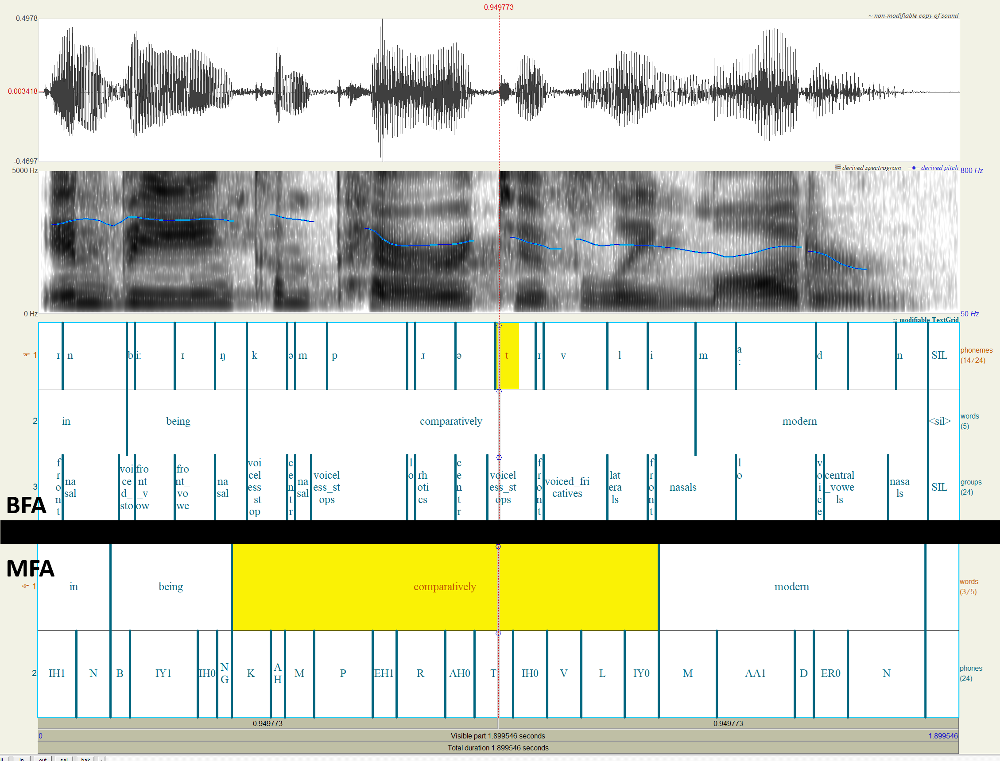
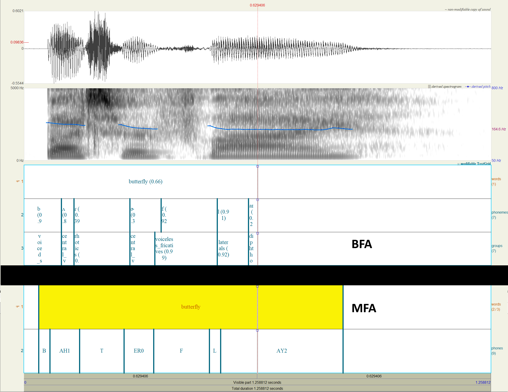

# 🎯 Bournemouth Forced Aligner (BFA)

<div align="center">

[](https://www.python.org/downloads/)
[](https://badge.fury.io/py/bournemouth-forced-aligner)
[](https://www.gnu.org/licenses/gpl-3.0)
[](https://github.com/tabahi/bournemouth-forced-aligner/stargazers)

**High-precision phoneme-level timestamp extraction from audio files**

[🚀 Quick Start](#-getting-started) • [📚 Documentation](#-how-does-it-work) • [🔧 Installation](#-installation) • [💻 CLI](#-command-line-interface-cli) • [🤝 Contributing](https://github.com/tabahi/bournemouth-forced-aligner/issues)

</div>

---

## ✨ Overview

BFA is a lightning-fast Python library that extracts **phoneme-level timestamps** from audio files with millisecond precision. Built on the powerful [Contextless Universal Phoneme Encoder (CUPE)](https://github.com/tabahi/contexless-phonemes-CUPE), it delivers professional-grade forced alignment for speech analysis, linguistics research, and audio processing applications.

> 🎯 **Find the exact time when any phoneme is spoken** - provided you have the audio and its text.

## 🌟 Key Features

<div align="center">

| Feature | Description | Performance |
|---------|-------------|-------------|
| ⚡ **Ultra-Fast** | CPU-optimized processing | 0.2s for 10s audio |
| 🎯 **Phoneme-Level** | Millisecond-precision timestamps | High accuracy alignment |
| 🧠 **Smart Algorithm** | Viterbi with confidence scoring | Target boosting support |
| 🌍 **Multi-Language** | Via espeak phonemization | *English model ready |
| 🔧 **Easy Integration** | JSON & TextGrid output | Praat compatibility |
| 📊 **Rich Embeddings** | Contextless phoneme features | ML-ready format |
| 💻 **CLI Ready** | Command-line interface | Batch processing support |

</div>

### 🎨 Core Capabilities

- **🎵 Phoneme-level timestamp extraction** with high accuracy
- **🔍 Viterbi algorithm** with confidence scoring and target boosting  
- **🌐 Multi-language support** via espeak phonemization (*English model currently available)
- **📊 Embedding extraction** - contextless, pure phoneme embeddings for ML tasks
- **📝 Word-level alignment** derived from phoneme timestamps
- **⚙️ Command-line interface** for hands-off batch processing
- **📋 Multiple output formats**: JSON and TextGrid for Praat integration

---

## 🚀 Installation

### 📦 From PyPI (Recommended)

```bash
# Install the package
pip install bournemouth-forced-aligner

# Install system dependencies
apt-get install espeak-ng ffmpeg
```

### ✅ Verify Installation

```bash
# Show help
balign --help

# Check version
balign --version

# Test installation
python -c "from bournemouth_aligner import PhonemeTimestampAligner; print('✅ Installation successful!')"
```

---

## 🎯 Getting Started

### 🔥 Quick Example

```python
import torch
import time
import json
from bournemouth_aligner import PhonemeTimestampAligner

# Configuration
text_sentence = "butterfly"
audio_path = "examples/samples/audio/109867__timkahn__butterfly.wav"
model_name = "en_libri1000_uj01d_e199_val_GER=0.2307.ckpt" # Find more models at: https://huggingface.co/Tabahi/CUPE-2i/tree/main/ckpt

# Initialize aligner
extractor = PhonemeTimestampAligner(
    model_name=model_name, 
    lang='en-us', 
    duration_max=10, 
    device='cpu'
)

# Load and process
audio_wav = extractor.load_audio(audio_path)

t0 = time.time()
timestamps = extractor.process_sentence(
    text_sentence, 
    audio_wav, 
    ts_out_path=None, 
    extract_embeddings=False, 
    vspt_path=None, 
    do_groups=True, 
    debug=True
)
t1 = time.time()

print("🎯 Timestamps:")
print(json.dumps(timestamps, indent=4, ensure_ascii=False))
print(f"⚡ Processing time: {t1 - t0:.2f} seconds")
```

### 📊 Sample Output

<details>
<summary>📋 Click to see detailed JSON output</summary>

```json
{
    "segments": [
        {
            "start": 0.0,
            "end": 1.2588125,
            "text": "butterfly",
            "ph66": [
                29,
                10,
                58,
                9,
                43,
                56,
                23
            ],
            "pg16": [
                7,
                2,
                14,
                2,
                8,
                13,
                5
            ],
            "coverage_analysis": {
                "target_count": 7,
                "aligned_count": 7,
                "missing_count": 0,
                "extra_count": 0,
                "coverage_ratio": 1.0,
                "missing_phonemes": [],
                "extra_phonemes": []
            },
            "ipa": [
                "b",
                "ʌ",
                "ɾ",
                "ɚ",
                "f",
                "l",
                "aɪ"
            ],
            "word_num": [
                0,
                0,
                0,
                0,
                0,
                0,
                0
            ],
            "words": [
                "butterfly"
            ],
            "phoneme_ts": [
                {
                    "phoneme_idx": 29,
                    "phoneme_label": "b",
                    "start_ms": 33.56833267211914,
                    "end_ms": 50.35249710083008,
                    "confidence": 0.9849503040313721
                },
                {
                    "phoneme_idx": 10,
                    "phoneme_label": "ʌ",
                    "start_ms": 100.70499420166016,
                    "end_ms": 117.48916625976562,
                    "confidence": 0.8435571193695068
                },
                {
                    "phoneme_idx": 58,
                    "phoneme_label": "ɾ",
                    "start_ms": 134.27333068847656,
                    "end_ms": 151.0574951171875,
                    "confidence": 0.3894280791282654
                },
                {
                    "phoneme_idx": 9,
                    "phoneme_label": "ɚ",
                    "start_ms": 285.3308410644531,
                    "end_ms": 302.114990234375,
                    "confidence": 0.3299962282180786
                },
                {
                    "phoneme_idx": 43,
                    "phoneme_label": "f",
                    "start_ms": 369.2516784667969,
                    "end_ms": 386.03582763671875,
                    "confidence": 0.9150863289833069
                },
                {
                    "phoneme_idx": 56,
                    "phoneme_label": "l",
                    "start_ms": 520.3091430664062,
                    "end_ms": 553.8775024414062,
                    "confidence": 0.9060741662979126
                },
                {
                    "phoneme_idx": 23,
                    "phoneme_label": "aɪ",
                    "start_ms": 604.22998046875,
                    "end_ms": 621.01416015625,
                    "confidence": 0.21650740504264832
                }
            ],
            "group_ts": [
                {
                    "group_idx": 7,
                    "group_label": "voiced_stops",
                    "start_ms": 33.56833267211914,
                    "end_ms": 50.35249710083008,
                    "confidence": 0.9911064505577087
                },
                {
                    "group_idx": 2,
                    "group_label": "central_vowels",
                    "start_ms": 100.70499420166016,
                    "end_ms": 117.48916625976562,
                    "confidence": 0.8446590304374695
                },
                {
                    "group_idx": 14,
                    "group_label": "rhotics",
                    "start_ms": 134.27333068847656,
                    "end_ms": 151.0574951171875,
                    "confidence": 0.28526052832603455
                },
                {
                    "group_idx": 2,
                    "group_label": "central_vowels",
                    "start_ms": 285.3308410644531,
                    "end_ms": 302.114990234375,
                    "confidence": 0.7377423048019409
                },
                {
                    "group_idx": 8,
                    "group_label": "voiceless_fricatives",
                    "start_ms": 352.4674987792969,
                    "end_ms": 402.8199768066406,
                    "confidence": 0.9877637028694153
                },
                {
                    "group_idx": 13,
                    "group_label": "laterals",
                    "start_ms": 520.3091430664062,
                    "end_ms": 553.8775024414062,
                    "confidence": 0.9163824915885925
                },
                {
                    "group_idx": 5,
                    "group_label": "diphthongs",
                    "start_ms": 604.22998046875,
                    "end_ms": 621.01416015625,
                    "confidence": 0.4117060899734497
                }
            ],
            "words_ts": [
                {
                    "word": "butterfly",
                    "start_ms": 33.56833267211914,
                    "end_ms": 621.01416015625,
                    "confidence": 0.6550856615815844,
                    "ph66": [
                        29,
                        10,
                        58,
                        9,
                        43,
                        56,
                        23
                    ],
                    "ipa": [
                        "b",
                        "ʌ",
                        "ɾ",
                        "ɚ",
                        "f",
                        "l",
                        "aɪ"
                    ]
                }
            ],
            "frames": [
                0,
                29,
                29,
                29,
                29,
                29,
                29,
                0,
                10,
                10,
                10,
                10,
                10,
                58,
                58,
                58,
                58,
                0,
                0,
                0,
                0,
                0,
                0,
                0,
                0,
                0,
                0,
                9,
                9,
                9,
                9,
                9,
                0,
                0,
                0,
                43,
                43,
                43,
                43,
                43,
                0,
                0,
                0,
                0,
                0,
                0,
                0,
                0,
                0,
                0,
                56,
                56,
                56,
                56,
                56,
                56,
                56,
                0,
                23,
                23,
                23,
                23,
                23,
                23,
                0,
                0,
                0,
                0,
                0,
                0,
                0,
                0,
                0,
                0,
                0,
                0,
                0,
                0,
                0,
                0,
                0,
                0,
                0,
                0,
                0,
                0,
                0,
                0,
                0,
                0,
                0,
                0,
                0,
                0,
                0,
                0,
                0,
                0,
                0,
                0,
                0,
                0,
                0,
                0,
                0,
                0,
                0,
                0,
                0,
                0,
                0,
                0,
                0,
                0,
                0,
                0,
                0,
                0,
                0,
                0,
                0,
                0,
                0,
                0,
                0,
                0
            ],
            "ms_per_frame": 10,
            "frames_compressed": [
                [
                    0,
                    1
                ],
                [
                    29,
                    6
                ],
                [
                    0,
                    1
                ],
                [
                    10,
                    5
                ],
                [
                    58,
                    4
                ],
                [
                    0,
                    10
                ],
                [
                    9,
                    5
                ],
                [
                    0,
                    3
                ],
                [
                    43,
                    5
                ],
                [
                    0,
                    10
                ],
                [
                    56,
                    7
                ],
                [
                    0,
                    1
                ],
                [
                    23,
                    6
                ],
                [
                    0,
                    62
                ]
            ]
        }
    ]
}
```

</details>

### 🔑 Output Format Guide

| Key | Description | Format |
|-----|-------------|--------|
| `ph66` | Standardized 66 phoneme classes (including silence) | See [mapper66.py](bournemouth_aligner/mapper66.py) |
| `pg16` | 16 phoneme category groups (lateral, vowels, rhotics, etc.) | Grouped classifications |
| `ipa` | IPA sequences from espeak | Unicode IPA symbols |
| `words` | Word segmentation | Regex-based: `\b\w+\b` |
| `phoneme_ts` | Aligned phoneme timestamps | Millisecond precision |
| `group_ts` | Phoneme group timestamps | Often more accurate |
| `word_num` | Word index for each phoneme | Maps phonemes to words |
| `words_ts` | Word-level timestamps | Derived from phonemes |
| `frames`   | List of Sequential frames of phoneme_idx (default) | Prealigned for 10ms (default) frames|
| `ms_per_frame`   | frames length value for `frames` assortment | Modify: PhonemeTimestampAligner(ms_per_frame=10) |
| `frames_compressed`   | List of `frames` compressed as [phoneme_idx, count] | Suitable for FastSpeech2 format |
| `coverage_analysis` | Alignment quality metrics | Insertions/deletions |

---

## 🛠️ Methods

### Initialization

```python
PhonemeTimestampAligner(
    model_name="en_libri1000_uj01d_e199_val_GER=0.2307.ckpt",
    cupe_ckpt_path=None,
    lang="en-us",
    duration_max=10,
    ms_per_frame=10,
    output_frames_key="phoneme_idx",
    device="cpu",
    boost_targets=True,
    enforce_minimum=True
)
```

**Parameters:**
- `model_name`: Name of the CUPE model (see [HuggingFace models](https://huggingface.co/Tabahi/CUPE-2i/tree/main/ckpt)). It's automatically downloaded and cached if available.
- `cupe_ckpt_path`: Local path to the model checkpoint.
- `lang`: Language code for phonemization ([espeak codes](https://github.com/espeak-ng/espeak-ng/blob/master/docs/languages.md)).
- `duration_max`: Maximum segment duration (seconds, for batch padding).
- `ms_per_frame`: Frame size in milliseconds (controls output frame rate, not alignment accuracy).
- `output_frames_key`: Output key for frame assortment (`phoneme_idx`, `phoneme_label`, `group_idx`, `group_label`).
- `device`: Inference device (`cpu` or `cuda`).
- `boost_targets`: Boost target phoneme probabilities for better alignment.
- `enforce_minimum`: Enforce minimum probability for target phonemes.

---

### Process SRT File

```python
PhonemeTimestampAligner.process_srt_file(
    srt_path,
    audio_path,
    ts_out_path=None,
    extract_embeddings=False,
    vspt_path=None,
    do_groups=True,
    debug=True
)
```

**Parameters:**
- `srt_path`: Path to input SRT file (whisper JSON format).
- `audio_path`: Path to audio file.
- `ts_out_path`: Output path for timestamps (vs2 format).
- `extract_embeddings`: Extract embeddings.
- `vspt_path`: Path to save embeddings (`.pt` file).
- `do_groups`: Extract group timestamps.
- `debug`: Enable debug output.

**Returns:**  
- `timestamps_dict`: Dictionary with extracted timestamps.

---

### Process text sentences

```python
PhonemeTimestampAligner.process_sentence(
    text,
    audio_wav,
    ts_out_path=None,
    extract_embeddings=False,
    vspt_path=None,
    do_groups=True,
    debug=False
)
```

**Parameters:**
- `text`: Sentence/text.
- `audio_wav`: Audio waveform tensor (`torch.Tensor`).
- `ts_out_path`: Output path for timestamps (optional).
- `extract_embeddings`: Extract embeddings (optional).
- `vspt_path`: Path to save embeddings (`.pt`, optional).
- `do_groups`: Extract group timestamps (optional).
- `debug`: Enable debug output (optional).

---
### 🗣️ Convert Text to Phonemes

Phonemization in BFA is powered by the [phonemizer](https://github.com/bootphon/phonemizer) package, using the [espeak-ng](https://github.com/espeak-ng/espeak-ng) backend for robust multi-language support.

```python
PhonemeTimestampAligner.phonemize_sentence(text)
```

**Optional:** Change the espeak language after initialization:
```python
PhonemeTimestampAligner.phonemizer.set_backend(language='en')
```

**Method Description:**

Phonemizes a sentence and returns a detailed mapping:

- `text`: Original input sentence
- `ipa`: List of phonemes in IPA format
- `ph66`: List of phoneme class indices (mapped to 66-class set)
- `pg16`: List of phoneme group indices (16 broad categories)
- `words`: List of words corresponding to phonemes
- `word_num`: Word indices for each phoneme

**Example Usage:**
```python
result = PhonemeTimestampAligner.phonemize_sentence("butterfly")
print(result["ipa"])    # ['b', 'ʌ', 'ɾ', 'ɚ', 'f', 'l', 'aɪ']
print(result["ph66"])  # [29, 10, 58, 9, 43, 56, 23]
print(result["pg16"])  # [7, 2, 14, 2, 8, 13, 5]
```


### Extract Timestamps from Segment

```python
PhonemeTimestampAligner.extract_timestamps_from_segment(
    wav,
    wav_len,
    phoneme_sequence,
    start_offset_time=0,
    group_sequence=None,
    extract_embeddings=True,
    do_groups=True,
    debug=True
)
```

**Parameters:**
- `wav`: Audio tensor for the segment. Shape: [1, samples]
- `wav_len`: Length of the audio segment (samples).
- `phoneme_sequence`: List/tensor of phoneme indices (ph66)
- `start_offset_time`: Segment start offset (seconds).
- `group_sequence`: Optional group indices (pg16).
- `extract_embeddings`: Extract pooled phoneme embeddings.
- `do_groups`: Extract phoneme group timestamps.
- `debug`: Enable debug output.

**Returns:**
- `timestamp_dict`: Contains phoneme and group timestamps.
- `pooled_embeddings_phonemes`: Pooled phoneme embeddings or `None`.
- `pooled_embeddings_groups`: Pooled group embeddings or `None`.

---

### Convert to TextGrid

```python
PhonemeTimestampAligner.convert_to_textgrid(
    timestamps_dict,
    output_file=None,
    include_confidence=False
)
```

**Description:**  
Converts VS2 timestamp data to [Praat TextGrid](https://www.fon.hum.uva.nl/praat/manual/TextGrid_file_format.html) format.

**Parameters:**
- `timestamps_dict`: Timestamp dictionary (from alignment).
- `output_file`: Path to save TextGrid file (optional).
- `include_confidence`: Include confidence values in output (optional).

**Returns:**  
- `textgrid_content`: TextGrid file content as string.


## 📈 Alignment Accuracy

### 🔬 Comparative Analysis

Our alignment quality compared to Montreal Forced Aligner (MFA) using [Praat](https://www.fon.hum.uva.nl/praat/) TextGrid visualization:

<div align="center">

| Metric | BFA | MFA |
|--------|-----|-----|
| **Speed** | 0.2s per 10s audio | 10s per 2s audio |
| **Real-time potential** | ✅ Yes (contextless) | ❌ No |
| **Stop consonants** | ✅ Better (t,d,p,k) | ⚠️ Standard |
| **Tail endings** | ⚠️ Sometimes missed | ✅ Good |
| **Breathy sounds** | ⚠️ Misses h# | ✅ Captures |

</div>

### 📊 Sample Visualizations

**"In being comparatively modern..."** - LJ Speech Dataset  
[🎵 Audio Sample](examples/samples/LJSpeech/LJ001-0002.wav)



**"Butterfly" with Confidence Values**  
[🎵 Audio Sample](examples/samples/audio/109867__timkahn__butterfly.wav)



> **Note**: Timing distance error is ~40ms on TIMIT dataset. BFA excels in real-time applications where MFA's 5x slower processing becomes prohibitive.

---

## 🧠 How Does It Work?

### 🔄 Processing Pipeline


**Core Components:**

1. **🎵 CUPE Integration**: Extracts phoneme probabilities from [CUPE models](https://huggingface.co/Tabahi/CUPE-2i)
2. **🧮 Viterbi Algorithm**: Performs optimal path finding through probability matrices
3. **🔄 Forward/Backward Tracing**: Identifies precise phoneme boundaries
4. **📊 Confidence Scoring**: Provides alignment quality metrics

> **Performance Note**: The algorithm is CPU-optimized due to iterative loops. GPU acceleration is planned for future releases.

---

## 🔧 Advanced Usage

### 🎙️ Whisper Integration

Extract timestamps directly from audio using Whisper transcription:

```python
# pip install git+https://github.com/openai/whisper.git 

import whisper
import json
from bournemouth_aligner import PhonemeTimestampAligner

# Transcribe with Whisper
model = whisper.load_model("turbo")
audio_path = "audio.wav"
result = model.transcribe(audio_path)

# Save transcription
srt_path = "whisper_output.srt.json"
with open(srt_path, "w") as f:
    json.dump(result, f)

# Align with BFA
extractor = PhonemeTimestampAligner(
    model_name="en_libri1000_uj01d_e199_val_GER=0.2307.ckpt", # Find more models at: https://huggingface.co/Tabahi/CUPE-2i/tree/main/ckpt
    lang='en-us',
    duration_max=10,
    device='cpu'
)

timestamps = extractor.process_srt_file(
    srt_path, 
    audio_path, 
    "timestamps.json",
    extract_embeddings=False,
    debug=False
)
```

### 🔬 Step-by-Step Processing

<details>
<summary>📖 Detailed notebook-style implementation</summary>

```python
import torch
import torchaudio
from bournemouth_aligner import PhonemeTimestampAligner

# Step 1: Initialize
device = 'cpu'  # CPU is faster for single files
duration_max = 10
model_name = "en_libri1000_uj01d_e199_val_GER=0.2307.ckpt" # Find more models at: https://huggingface.co/Tabahi/CUPE-2i/tree/main/ckpt
lang = 'en-us'

extractor = PhonemeTimestampAligner(
    model_name=model_name,
    lang=lang,
    duration_max=duration_max,
    device=device
)

# Step 2a: Manual audio preprocessing
audio_path = "examples/samples/audio/Schwa-What.wav"
audio_wav, sr = torchaudio.load(audio_path, normalize=True)

# Resample to CUPE's 16kHz
resampler = torchaudio.transforms.Resample(
    orig_freq=sr,
    new_freq=16000,
    lowpass_filter_width=64,
    rolloff=0.9475937167399596,
    resampling_method="sinc_interp_kaiser",
    beta=14.769656459379492,
)
audio_wav = resampler(audio_wav)

# RMS normalize
rms = torch.sqrt(torch.mean(audio_wav ** 2))
audio_wav = (audio_wav / rms) if rms > 0 else audio_wav

# Step 2b: Simplified loading
# audio_wav = extractor.load_audio(audio_path)

# Step 3: Process text_sentence
text_sentence = "ah What!"
timestamps = extractor.process_sentence(
    text_sentence,
    audio_wav,
    ts_out_path=None,
    extract_embeddings=False,
    vspt_path=None,
    do_groups=True,
    debug=False
)

# Step 4: Export to TextGrid
extractor.convert_to_textgrid(
    timestamps,
    output_file="output_timestamps.TextGrid",
    include_confidence=False
)
```

</details>

### 🤖 Machine Learning Integration

For phoneme embeddings in ML pipelines, check out our [embeddings example](examples/read_embeddings.py).

---

## 💻 Command Line Interface (CLI)

### 🚀 Quick CLI Usage

```bash
# Basic alignment
balign audio.wav transcription.srt.json output.json

# With debug output
balign audio.wav transcription.srt.json output.json --debug

# Extract embeddings
balign audio.wav transcription.srt.json output.json --embeddings embeddings.pt
```

### ⚙️ Command Syntax

```bash
balign [OPTIONS] AUDIO_PATH SRT_PATH OUTPUT_PATH
```

### 📝 Arguments & Options

<div align="center">

| Parameter | Type | Default | Description |
|-----------|------|---------|-------------|
| `AUDIO_PATH` | **Required** | - | Audio file path (.wav, .mp3, .flac) |
| `SRT_PATH` | **Required** | - | SRT JSON file path |
| `OUTPUT_PATH` | **Required** | - | Output timestamps (.json) |

</div>

<details>
<summary>🔧 Advanced Options</summary>

| Option | Default | Description |
|--------|---------|-------------|
| `--model TEXT` | `en_libri1000_uj01d_e199_val_GER=0.2307.ckpt` | CUPE model from [HuggingFace](https://huggingface.co/Tabahi/CUPE-2i/tree/main/ckpt) |
| `--lang TEXT` | `en-us` | Language code ([espeak codes](https://github.com/espeak-ng/espeak-ng/blob/master/docs/languages.md)) |
| `--device TEXT` | `cpu` | Processing device (`cpu` or `cuda`) |
| `--embeddings PATH` | None | Save phoneme embeddings (.pt file) |
| `--duration-max FLOAT` | `10.0` | Max segment duration (seconds) |
| `--debug / --no-debug` | `False` | Enable detailed output |
| `--boost-targets / --no-boost-targets` | `True` | Enable target phoneme boosting |
| `--help` | | Show help message |
| `--version` | | Show version info |

</details>

### 🌟 CLI Examples

<details>
<summary>📚 Comprehensive usage examples</summary>

#### Basic Operations
```bash
# Simple English alignment
balign speech.wav transcription.srt.json timestamps.json

# With embeddings for ML
balign speech.wav transcription.srt.json timestamps.json --embeddings speech_embeddings.pt
```

#### Multi-language Support (*Planned)
```bash
# Spanish audio
balign spanish_audio.wav transcription.srt.json output.json --lang es

# French audio  
balign french_audio.wav transcription.srt.json output.json --lang fr

# German audio
balign german_audio.wav transcription.srt.json output.json --lang de
```

#### Performance Optimization
```bash
# GPU acceleration
balign large_audio.wav transcription.srt.json output.json --device cuda

# Custom model with extended duration
balign audio.wav transcription.srt.json output.json \
    --model "en_libri1000_uj01d_e199_val_GER=0.2307.ckpt" \
    --duration-max 15 \
    --debug \
    --embeddings embeddings.pt
```

#### Batch Processing
```bash
#!/bin/bash
# Process multiple files
for audio in *.wav; do
    base=$(basename "$audio" .wav)
    balign "$audio" "${base}.srt" "${base}_timestamps.json" --debug
done
```

</details>

### 📊 Input Format

SRT files must be in JSON format:

```json
{
  "segments": [
    {
      "start": 0.0,
      "end": 3.5,
      "text": "hello world this is a test"
    },
    {
      "start": 3.5,
      "end": 7.2,  
      "text": "another segment of speech"
    }
  ]
}
```

### 🎯 Creating Input Files

<details>
<summary>📝 Methods for generating SRT files</summary>

**From Whisper:**
```python
import whisper
import json

model = whisper.load_model("base")
result = model.transcribe("audio.wav")

# Convert to BFA format
srt_data = {"segments": result["segments"]}
with open("transcription.srt.json", "w") as f:
    json.dump(srt_data, f, indent=2)
```

**Manual Creation:**
```python
import json

srt_data = {
    "segments": [
        {
            "start": 0.0,
            "end": 2.5,
            "text": "your transcribed text here"
        }
    ]
}

with open("transcription.srt.json", "w") as f:
    json.dump(srt_data, f, indent=2)
```

</details>

### 🔍 Debug Mode

Enable comprehensive processing information:

```bash
balign audio.wav transcription.srt.json output.json --debug
```

<details>
<summary>📊 Sample debug output</summary>

```
🚀 Bournemouth Forced Aligner
🎵 Audio: audio.wav
📄 SRT: transcription.srt.json  
💾 Output: output.json
🏷️  Language: en-us
🖥️  Device: cpu
🎯 Model: en_libri1000_uj01d_e199_val_GER=0.2307.ckpt
--------------------------------------------------
🔧 Initializing aligner...
Setting backend for language: en-us
✅ Aligner initialized successfully
🎵 Processing audio...
Loaded SRT file with 1 segments from transcription.srt.json
Resampling audio.wav from 22050Hz to 16000Hz
Expected phonemes: ['p', 'ɹ', 'ɪ', ...'ʃ', 'ə', 'n']
Target phonemes: 108, Expected: ['p', 'ɹ', 'ɪ', ..., 'ʃ', 'ə', 'n']
Spectral length: 600
Forced alignment took 135.305 ms
Aligned phonemes: 108
Target phonemes: 108
SUCCESS: All target phonemes were aligned!

============================================================
PROCESSING SUMMARY
============================================================
Total segments processed: 1
Perfect sequence matches: 1/1 (100.0%)
Total phonemes aligned: 108
Overall average confidence: 0.502
============================================================
Results saved to: output.json
✅ Timestamps extracted to output.json
📊 Processed 1 segments with 108 phonemes
🎉 Processing completed successfully!
```

</details>

---

## 🤝 Contributing & Support

<div align="center">

### 📞 Get Help

[](https://github.com/tabahi/bournemouth-forced-aligner/issues)

</div>


### 💡 Feature Requests

We welcome suggestions for:
- Additional language models
- Performance improvements  
- New output formats
- Integration examples

### 🔬 Research Collaboration

If you use BFA in academic research, we'd love to hear about it! Consider:
- Sharing your findings and comparisons
- Contributing evaluation datasets
- Proposing algorithmic improvements


---

<div align="center">


[⭐ Star us on GitHub](https://github.com/tabahi/bournemouth-forced-aligner) • [🐛 Report Issues](https://github.com/tabahi/bournemouth-forced-aligner/issues)

</div>
