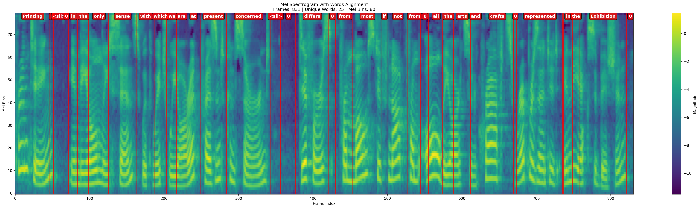
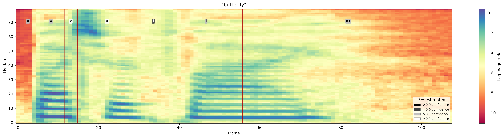
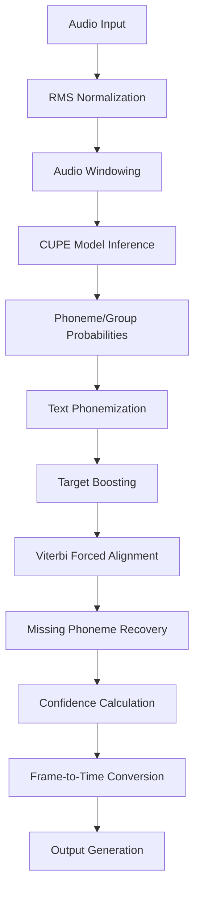
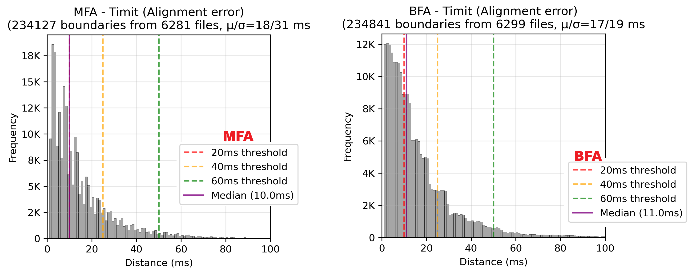

# Bournemouth Forced Aligner (BFA)

<div align="center">

[](https://www.python.org/downloads/)
[](https://badge.fury.io/py/bournemouth-forced-aligner)
[](https://www.gnu.org/licenses/gpl-3.0)
[](https://github.com/tabahi/bournemouth-forced-aligner/stargazers)

**Automatically label which phoneme is spoken at which millisecond in an audio recording.**

[🚀 Quick Start](#getting-started) • [🔧 Installation](#-installation) • [🌍 Languages](#-language-presets) • [💻 CLI](#-command-line-interface-cli) • [🐛 Issues](https://github.com/tabahi/bournemouth-forced-aligner/issues)

</div>

---

## What does it do?

**Forced alignment** is the process of automatically finding *exactly when* each word or sound occurs in an audio recording, given a transcript of what was said.

BFA takes two inputs — an **audio file** and its **text transcript** — and produces a detailed output with millisecond timestamps for every phoneme (the individual sounds that make up words).

```
Input:  🎵 audio.wav  +  📄 "butterfly"

Output:
  b  →  33 ms – 50 ms   (confidence: 0.99)
  ʌ  →  100 ms – 117 ms (confidence: 0.84)
  ɾ  →  134 ms – 151 ms (confidence: 0.29)
  ɚ  →  285 ms – 302 ms (confidence: 0.74)
  f  →  352 ms – 403 ms (confidence: 0.99)
  l  →  520 ms – 554 ms (confidence: 0.92)
  aɪ →  604 ms – 621 ms (confidence: 0.41)
```

The output can be exported as a **Praat TextGrid** file for visual inspection, or as **JSON** for use in scripts and TTS pipelines.

### Key Facts

| | |
|---|---|
| ⚡ Speed | ~0.2 seconds to align 10 seconds of audio (on CPU) |
| 🌍 Languages | 80+ languages — English, German, French, Spanish, Hindi, Arabic, and many more |
| 📄 Output formats | JSON timestamps, Praat TextGrid, phoneme embeddings |
| 🖥️ Runs on | Linux, macOS, Windows — CPU or GPU |

---

## *What's new in v1.1.0* (February 2026)

- **Better long-sentence handling** — silence anchoring now splits long segments at pauses (like commas and full stops), making alignment significantly more accurate for full sentences.
- **Original IPA labels preserved** — the output now includes both the standardised ph66 label and the original espeak-ng IPA form, which is useful for fine-grained phonetic analysis and TTS training.
- **Improved quality checks** — `coverage_analysis` in the output now runs multiple alignment quality tests. If `"bad_confidence": true`, that segment is likely unreliable and should be discarded.
- **⚠️ Breaking change** — v1.1.0 refactors the API for batch processing. Code written for v1.0.x will need minor updates (see [CHANGELOG](CHANGELOG.md)).

---

**Words and phonemes aligned to a Mel-spectrogram:**




*See [mel_spectrum_alignment.py](examples/mel_spectrum_alignment.py) for a full example.*

---

## 🚀 Installation

> **Prerequisites:** Python 3.8 or newer. If you don't have Python yet, download it from [python.org](https://www.python.org/downloads/).

### Step 1 — Install system dependencies

**Linux (Ubuntu / Debian):**
```bash
sudo apt-get install espeak-ng ffmpeg
```

**macOS:**
```bash
brew install espeak-ng ffmpeg
```

**Windows:**  
Download and install [eSpeak NG](https://github.com/espeak-ng/espeak-ng/blob/master/docs/guide.md) and [ffmpeg](https://ffmpeg.org/download.html), then add both to your system PATH.

### Step 2 — Install BFA

```bash
pip install bournemouth-forced-aligner
```

### Step 3 — Verify it works

```bash
python -c "from bournemouth_aligner import PhonemeTimestampAligner; print('Installation successful!')"
```

---

## Getting Started

### Quickstart — command line

If you just want to try BFA on a file right away, no Python needed:

```bash
balign butterfly.wav "butterfly" --preset=en-us --mel-path=mel_spectrum.png
```

This aligns the word *butterfly* in [`butterfly.wav`](examples/samples/audio/109867__timkahn__butterfly.wav), saves the phoneme timestamps to `butterfly.vs.json` (same folder as the audio), and also saves a mel-spectrogram image to [`mel_spectrum.png`](mel_spectrum_butterfly.png).


---




> **Tip:** Replace `"butterfly"` with any sentence spoken in the audio, and `--preset=en-us` with your language code (`de`, `fr`, `hi`, `ar`, …). Run `balign --help` to see more options.


### Python example

```python
from bournemouth_aligner import PhonemeTimestampAligner

# 1. Create the aligner — it will automatically download the right model
#    Change "en-us" to your language code, e.g. "de", "fr", "es", "hi"
aligner = PhonemeTimestampAligner(preset="en-us")

# 2. Load your audio file (WAV, MP3, FLAC, etc.)
audio = aligner.load_audio("butterfly.wav")

# 3. Run alignment
#    Provide the transcript exactly as spoken in the audio
result = aligner.process_sentence("butterfly", audio)

# 4. Print the phoneme timestamps
for phoneme in result["segments"][0]["phoneme_ts"]:
    print(f"{phoneme['ipa_label']:>5}  {phoneme['start_ms']:.0f} ms – {phoneme['end_ms']:.0f} ms  (confidence: {phoneme['confidence']:.2f})")
```

That's it. No configuration files, no dictionary downloads, no corpus setup.

> **Note:** The first run will automatically download the model from HuggingFace (~50 MB). Subsequent runs use the cached copy.

### Export to Praat TextGrid

```python
# Save a TextGrid file that you can open directly in Praat
aligner.convert_to_textgrid(result, output_file="my_recording.TextGrid")
```

### Multi-language examples

```python
# German
aligner_de = PhonemeTimestampAligner(preset="de")

# French
aligner_fr = PhonemeTimestampAligner(preset="fr")

# Hindi
aligner_hi = PhonemeTimestampAligner(preset="hi")

# Spanish
aligner_es = PhonemeTimestampAligner(preset="es")
```

See the [full preset list](#-language-presets) for all 80+ supported languages.

---

### 📊 Sample Output

<details>
<summary>📋 Click to see the full JSON output for "butterfly"</summary>

```json

{
    "segments": [
        {
            "start": 0.0,
            "end": 1.2588125,
            "text": "butterfly",
            "ph66": [
                29,
                10,
                58,
                9,
                43,
                56,
                23
            ],
            "pg16": [
                7,
                2,
                14,
                2,
                8,
                13,
                5
            ],
            "coverage_analysis": {
                "target_count": 7,
                "aligned_count": 7,
                "missing_count": 0,
                "extra_count": 0,
                "coverage_ratio": 1.0,
                "missing_phonemes": [],
                "extra_phonemes": []
            },
            "ipa": [
                "b",
                "ʌ",
                "ɾ",
                "ɚ",
                "f",
                "l",
                "aɪ"
            ],
            "word_num": [
                0,
                0,
                0,
                0,
                0,
                0,
                0
            ],
            "words": [
                "butterfly"
            ],
            "phoneme_ts": [
                {
                    "phoneme_id": 29,
                    "phoneme_label": "b",
                    "ipa_label": "b",
                    "start_ms": 33.56833267211914,
                    "end_ms": 50.35249710083008,
                    "confidence": 0.9970603585243225,
                    "is_estimated": false,
                    "target_seq_idx": 0,
                    "index": 0
                },
                {
                    "phoneme_id": 10,
                    "phoneme_label": "ʌ",
                    "ipa_label": "ʌ",
                    "start_ms": 100.70499420166016,
                    "end_ms": 117.48916625976562,
                    "confidence": 0.8809734582901001,
                    "is_estimated": false,
                    "target_seq_idx": 1,
                    "index": 1
                },
                {
                    "phoneme_id": 58,
                    "phoneme_label": "ɾ",
                    "ipa_label": "ɾ",
                    "start_ms": 134.27333068847656,
                    "end_ms": 151.0574951171875,
                    "confidence": 0.07298105955123901,
                    "is_estimated": false,
                    "target_seq_idx": 2,
                    "index": 2
                },
                {
                    "phoneme_id": 9,
                    "phoneme_label": "ɚ",
                    "ipa_label": "ɚ",
                    "start_ms": 285.3308410644531,
                    "end_ms": 302.114990234375,
                    "confidence": 0.18375618755817413,
                    "is_estimated": false,
                    "target_seq_idx": 3,
                    "index": 3
                },
                {
                    "phoneme_id": 43,
                    "phoneme_label": "f",
                    "ipa_label": "f",
                    "start_ms": 369.2516784667969,
                    "end_ms": 402.8199768066406,
                    "confidence": 0.952548086643219,
                    "is_estimated": false,
                    "target_seq_idx": 4,
                    "index": 4
                },
                {
                    "phoneme_id": 56,
                    "phoneme_label": "l",
                    "ipa_label": "l",
                    "start_ms": 520.3091430664062,
                    "end_ms": 553.8775024414062,
                    "confidence": 0.9023684859275818,
                    "is_estimated": false,
                    "target_seq_idx": 5,
                    "index": 5
                },
                {
                    "phoneme_id": 23,
                    "phoneme_label": "aɪ",
                    "ipa_label": "aɪ",
                    "start_ms": 604.22998046875,
                    "end_ms": 621.01416015625,
                    "confidence": 0.11104730516672134,
                    "is_estimated": false,
                    "target_seq_idx": 6,
                    "index": 6
                }
            ],
            "group_ts": [
                {
                    "group_id": 7,
                    "group_label": "voiced_stops",
                    "start_ms": 33.56833267211914,
                    "end_ms": 50.35249710083008,
                    "confidence": 0.9979244470596313,
                    "is_estimated": false,
                    "target_seq_idx": 0,
                    "index": 0
                },
                {
                    "group_id": 2,
                    "group_label": "central_vowels",
                    "start_ms": 100.70499420166016,
                    "end_ms": 117.48916625976562,
                    "confidence": 0.9000658392906189,
                    "is_estimated": false,
                    "target_seq_idx": 1,
                    "index": 1
                },
                {
                    "group_id": 14,
                    "group_label": "rhotics",
                    "start_ms": 117.48916625976562,
                    "end_ms": 151.0574951171875,
                    "confidence": 0.0318431481719017,
                    "is_estimated": false,
                    "target_seq_idx": 2,
                    "index": 2
                },
                {
                    "group_id": 2,
                    "group_label": "central_vowels",
                    "start_ms": 285.3308410644531,
                    "end_ms": 302.114990234375,
                    "confidence": 0.5893039703369141,
                    "is_estimated": false,
                    "target_seq_idx": 3,
                    "index": 3
                },
                {
                    "group_id": 8,
                    "group_label": "voiceless_fricatives",
                    "start_ms": 352.4674987792969,
                    "end_ms": 402.8199768066406,
                    "confidence": 0.9883034229278564,
                    "is_estimated": false,
                    "target_seq_idx": 4,
                    "index": 4
                },
                {
                    "group_id": 13,
                    "group_label": "laterals",
                    "start_ms": 520.3091430664062,
                    "end_ms": 553.8775024414062,
                    "confidence": 0.8932946920394897,
                    "is_estimated": false,
                    "target_seq_idx": 5,
                    "index": 5
                },
                {
                    "group_id": 5,
                    "group_label": "diphthongs",
                    "start_ms": 604.22998046875,
                    "end_ms": 621.01416015625,
                    "confidence": 0.42801225185394287,
                    "is_estimated": false,
                    "target_seq_idx": 6,
                    "index": 6
                }
            ],
            "words_ts": [
                {
                    "word": "butterfly",
                    "start_ms": 33.56833267211914,
                    "end_ms": 621.01416015625,
                    "confidence": 0.585819277380194,
                    "ph66": [
                        29,
                        10,
                        58,
                        9,
                        43,
                        56,
                        23
                    ],
                    "ipa": [
                        "b",
                        "ʌ",
                        "ɾ",
                        "ɚ",
                        "f",
                        "l",
                        "aɪ"
                    ]
                }
            ]
        }
    ]
}
```

</details>

### Understanding the Output

Every segment in the output contains the following keys:

| Key | What it contains | Useful for |
|-----|-----------------|------------|
| `phoneme_ts` | Per-phoneme timestamps: `ipa_label`, `start_ms`, `end_ms`, `confidence`, `is_estimated` | Phonetic annotation, TTS training |
| `group_ts` | Same timestamps but grouped into 16 broad phoneme categories (vowels, stops, fricatives…) | Coarser acoustic analysis |
| `words_ts` | Word-level timestamps derived from the phonemes | Word-level annotation |
| `ipa` | IPA sequence for the segment (from espeak-ng) | Phonemic transcription reference |
| `ph66` | Numeric indices into BFA's 66-class phoneme set | Model-internal representation |
| `pg16` | Numeric indices into 16 phoneme group categories | Model-internal representation |
| `words` | List of words in the segment | Word boundary reference |
| `word_num` | Word index for each phoneme (parallel to `ph66`) | Maps each phoneme to its parent word |
| `coverage_analysis` | Quality report: how many phonemes were aligned, missing, or estimated | Filtering out bad segments |

**Reading `confidence`:** A value close to `1.0` means the model was very sure this phoneme occurred at this time. Values below `0.2` should be treated with caution. If `is_estimated` is `true`, the phoneme was placed by the recovery mechanism (not found by the primary Viterbi pass) — filter these out for high-precision work.

---

---

## 🛠️ API Reference

### 🌍 Language Presets

BFA supports **80+ languages**. Just pass the language code as `preset` and the right model is selected automatically. Phonemisation is handled by [espeak-ng](https://github.com/espeak-ng/espeak-ng), which is free and works offline.

**Supported language families:** Indo-European (Germanic, Romance, Slavic, Indic, Iranian…), Turkic, Semitic, Dravidian, and several others.

**Not supported:** Tonal languages — Chinese (Mandarin, Cantonese), Vietnamese, Thai, Burmese — and isolating/agglutinative families such as Japanese and Korean, because the underlying acoustic model was not trained on them.

```python
aligner = PhonemeTimestampAligner(preset="de")   # German
aligner = PhonemeTimestampAligner(preset="hi")   # Hindi
aligner = PhonemeTimestampAligner(preset="fr")   # French
aligner = PhonemeTimestampAligner(preset="ar")   # Arabic
aligner = PhonemeTimestampAligner(preset="ru")   # Russian
```

#### 📋 Complete Preset Table

<details>
<summary>🔍 Click to view all 80+ supported language presets</summary>

| **Language** | **Preset Code** | **Model Used** | **Language Family** |
|--------------|-----------------|----------------|-------------------|
| **🇺🇸 ENGLISH VARIANTS** | | |
| English (US) | `en-us`, `en` | English Model | West Germanic |
| English (UK) | `en-gb` | English Model | West Germanic |
| English (Caribbean) | `en-029` | English Model | West Germanic |
| English (Lancastrian) | `en-gb-x-gbclan` | English Model | West Germanic |
| English (RP) | `en-gb-x-rp` | English Model | West Germanic |
| English (Scottish) | `en-gb-scotland` | English Model | West Germanic |
| English (West Midlands) | `en-gb-x-gbcwmd` | English Model | West Germanic |
| **🇪🇺 EUROPEAN LANGUAGES (MLS8)** | | |
| German | `de` | MLS8 Model | West Germanic |
| French | `fr` | MLS8 Model | Romance |
| French (Belgium) | `fr-be` | MLS8 Model | Romance |
| French (Switzerland) | `fr-ch` | MLS8 Model | Romance |
| Spanish | `es` | MLS8 Model | Romance |
| Spanish (Latin America) | `es-419` | MLS8 Model | Romance |
| Italian | `it` | MLS8 Model | Romance |
| Portuguese | `pt` | MLS8 Model | Romance |
| Portuguese (Brazil) | `pt-br` | MLS8 Model | Romance |
| Polish | `pl` | MLS8 Model | West Slavic |
| Dutch | `nl` | MLS8 Model | West Germanic |
| Danish | `da` | MLS8 Model | North Germanic |
| Swedish | `sv` | MLS8 Model | North Germanic |
| Norwegian Bokmål | `nb` | MLS8 Model | North Germanic |
| Icelandic | `is` | MLS8 Model | North Germanic |
| Czech | `cs` | MLS8 Model | West Slavic |
| Slovak | `sk` | MLS8 Model | West Slavic |
| Slovenian | `sl` | MLS8 Model | South Slavic |
| Croatian | `hr` | MLS8 Model | South Slavic |
| Bosnian | `bs` | MLS8 Model | South Slavic |
| Serbian | `sr` | MLS8 Model | South Slavic |
| Macedonian | `mk` | MLS8 Model | South Slavic |
| Bulgarian | `bg` | MLS8 Model | South Slavic |
| Romanian | `ro` | MLS8 Model | Romance |
| Hungarian | `hu` | MLS8 Model | Uralic |
| Estonian | `et` | MLS8 Model | Uralic |
| Latvian | `lv` | MLS8 Model | Baltic |
| Lithuanian | `lt` | MLS8 Model | Baltic |
| Catalan | `ca` | MLS8 Model | Romance |
| Aragonese | `an` | MLS8 Model | Romance |
| Papiamento | `pap` | MLS8 Model | Romance |
| Haitian Creole | `ht` | MLS8 Model | Romance |
| Afrikaans | `af` | MLS8 Model | West Germanic |
| Luxembourgish | `lb` | MLS8 Model | West Germanic |
| Irish Gaelic | `ga` | MLS8 Model | Celtic |
| Scottish Gaelic | `gd` | MLS8 Model | Celtic |
| Welsh | `cy` | MLS8 Model | Celtic |
| **🌏 INDO-EUROPEAN LANGUAGES (Universal)** | | |
| Russian | `ru` | Universal Model | East Slavic |
| Russian (Latvia) | `ru-lv` | Universal Model | East Slavic |
| Ukrainian | `uk` | Universal Model | East Slavic |
| Belarusian | `be` | Universal Model | East Slavic |
| Hindi | `hi` | Universal Model | Indic |
| Bengali | `bn` | Universal Model | Indic |
| Urdu | `ur` | Universal Model | Indic |
| Punjabi | `pa` | Universal Model | Indic |
| Gujarati | `gu` | Universal Model | Indic |
| Marathi | `mr` | Universal Model | Indic |
| Nepali | `ne` | Universal Model | Indic |
| Assamese | `as` | Universal Model | Indic |
| Oriya | `or` | Universal Model | Indic |
| Sinhala | `si` | Universal Model | Indic |
| Konkani | `kok` | Universal Model | Indic |
| Bishnupriya Manipuri | `bpy` | Universal Model | Indic |
| Sindhi | `sd` | Universal Model | Indic |
| Persian | `fa` | Universal Model | Iranian |
| Persian (Latin) | `fa-latn` | Universal Model | Iranian |
| Kurdish | `ku` | Universal Model | Iranian |
| Greek (Modern) | `el` | Universal Model | Greek |
| Greek (Ancient) | `grc` | Universal Model | Greek |
| Armenian (East) | `hy` | Universal Model | Indo-European |
| Armenian (West) | `hyw` | Universal Model | Indo-European |
| Albanian | `sq` | Universal Model | Indo-European |
| Latin | `la` | Universal Model | Italic |
| **🇹🇷 TURKIC LANGUAGES (Universal)** | | |
| Turkish | `tr` | Universal Model | Turkic |
| Azerbaijani | `az` | Universal Model | Turkic |
| Kazakh | `kk` | Universal Model | Turkic |
| Kyrgyz | `ky` | Universal Model | Turkic |
| Uzbek | `uz` | Universal Model | Turkic |
| Tatar | `tt` | Universal Model | Turkic |
| Turkmen | `tk` | Universal Model | Turkic |
| Uyghur | `ug` | Universal Model | Turkic |
| Bashkir | `ba` | Universal Model | Turkic |
| Chuvash | `cu` | Universal Model | Turkic |
| Nogai | `nog` | Universal Model | Turkic |
| **🇫🇮 URALIC LANGUAGES (Universal)** | | |
| Finnish | `fi` | Universal Model | Uralic |
| Lule Saami | `smj` | Universal Model | Uralic |
| **🕌 SEMITIC LANGUAGES (Universal)** | | |
| Arabic | `ar` | Universal Model | Semitic |
| Hebrew | `he` | Universal Model | Semitic |
| Amharic | `am` | Universal Model | Semitic |
| Maltese | `mt` | Universal Model | Semitic |
| **🏝️ MALAYO-POLYNESIAN LANGUAGES (Universal)** | | |
| Indonesian | `id` | Universal Model | Malayo-Polynesian |
| Malay | `ms` | Universal Model | Malayo-Polynesian |
| **🇮🇳 DRAVIDIAN LANGUAGES (Universal)** | | |
| Tamil | `ta` | Universal Model | Dravidian |
| Telugu | `te` | Universal Model | Dravidian |
| Kannada | `kn` | Universal Model | Dravidian |
| Malayalam | `ml` | Universal Model | Dravidian |
| **🇬🇪 SOUTH CAUCASIAN LANGUAGES (Universal)** | | |
| Georgian | `ka` | Universal Model | South Caucasian |
| **🗾 LANGUAGE ISOLATES & OTHERS (Universal)** | | |
| Basque | `eu` | Universal Model | Language Isolate |
| Quechua | `qu` | Universal Model | Quechuan |
| **🛸 CONSTRUCTED LANGUAGES (Universal)** | | |
| Esperanto | `eo` | Universal Model | Constructed |
| Interlingua | `ia` | Universal Model | Constructed |
| Ido | `io` | Universal Model | Constructed |
| Lingua Franca Nova | `lfn` | Universal Model | Constructed |
| Lojban | `jbo` | Universal Model | Constructed |
| Pyash | `py` | Universal Model | Constructed |
| Lang Belta | `qdb` | Universal Model | Constructed |
| Quenya | `qya` | Universal Model | Constructed |
| Klingon | `piqd` | Universal Model | Constructed |
| Sindarin | `sjn` | Universal Model | Constructed |

</details>

#### 🔧 Model Selection Guide

| **Model** | **Languages** | **Use Case** | **Performance** |
|-----------|---------------|--------------|-----------------|
| **English Model** | English variants | Best for English | Highest accuracy for English |
| **MLS8 Model** | 8 European + similar | European languages | High accuracy for European |
| **Universal Model** | 60+ Indo-European + related | Other supported languages | Good for Indo-European families |

**⚠️ Unsupported Language Types:**
- **Tonal languages**: Chinese (Mandarin, Cantonese), Vietnamese, Thai, Burmese
- **Distant families**: Japanese, Korean, most African languages (Swahili, etc.)
- **Indigenous languages**: Most Native American, Polynesian (except Indonesian/Malay)
- **Recommendation**: For unsupported languages, use explicit `model_name` parameter with caution

### Initialization

```python
PhonemeTimestampAligner(
    preset="en-us",               # Language code — selects model and phonemiser automatically
    model_name=None,              # Override the model by name (optional)
    cupe_ckpt_path=None,          # Override with a local model file path (optional)
    lang="en-us",                 # espeak-ng language code for phonemisation
    duration_max=10,              # Max segment length in seconds (used for padding)
    device="auto",                # "auto" | "cpu" | "cuda" | "mps"
    silence_anchors=0,            # >0 enables silence-anchored splitting (try 3 for long sentences)
    boost_targets=True,           # Boost acoustic probability of target phonemes before alignment
    enforce_minimum=True,         # Prevent phonemes from being completely zeroed out
    enforce_all_targets=True,     # Guarantee every phoneme in the transcript gets a timestamp
    ignore_noise=True,            # Skip predicted noise frames in output
    extend_soft_boundaries=True,  # Extend phoneme boundaries into adjacent low-confidence frames
    boundary_softness=7,          # How far to extend (2=tight cores only, 7=generous)
    bad_confidence_threshold=0.6  # Flag segments where >60% of phonemes are low-confidence
)
```

**For most users, only `preset` and `duration_max` need to be changed.** The alignment defaults are tuned for clean read speech.

<details>
<summary>Parameter details</summary>

| Parameter | Default | What it does |
|-----------|---------|-------------|
| `preset` | `"en-us"` | Language code. Automatically picks the right model and espeak-ng language. |
| `model_name` | `None` | Name of a specific CUPE model. Overrides `preset`. Downloaded from HuggingFace if not cached. |
| `cupe_ckpt_path` | `None` | Path to a local model `.ckpt` file. Highest priority. |
| `lang` | `"en-us"` | espeak-ng language code for phonemisation. See [all codes](https://github.com/espeak-ng/espeak-ng/blob/master/docs/languages.md). |
| `duration_max` | `10` | Maximum segment duration in seconds. Longer audio is truncated. Keep ≤30 s for best results. |
| `device` | `"auto"` | `"auto"` detects CUDA/MPS/CPU automatically. |
| `silence_anchors` | `0` | When >0, uses detected silences as anchor points to improve long-segment alignment. Try `3`. |
| `boost_targets` | `True` | Increases the acoustic probability of expected phonemes before Viterbi decoding. |
| `enforce_minimum` | `True` | Prevents any target phoneme from being completely zeroed out by the model. |
| `enforce_all_targets` | `True` | After decoding, inserts any missing phonemes at their best estimated position. Set `False` for strictly probabilistic output. |
| `ignore_noise` | `True` | Drops predicted noise/silence frames from output. Set `False` to include them as `"noise"` entries. |
| `extend_soft_boundaries` | `True` | Extends phoneme boundaries into adjacent frames that still carry some acoustic evidence. |
| `boundary_softness` | `7` | Controls how far boundaries extend. `2`–`3` = tight phoneme cores; `7` = generous boundaries. |
| `bad_confidence_threshold` | `0.6` | Ratio of low-confidence phonemes that triggers a `bad_alignment` warning on a segment. |

**Model priority (highest → lowest):** `cupe_ckpt_path` → `model_name` → `preset` → defaults.

</details>

---

**Available models** (downloaded automatically on first use):

| Model name | Best for |
|------------|----------|
| `en_libri1000_ua01c_e4_val_GER=0.2186.ckpt` | English (recommended) |
| `multi_MLS8_uh02_e36_val_GER=0.2334.ckpt` | German, French, Spanish, Italian, Portuguese, Polish, Dutch |
| `large_multi_mswc38_ua02g_e03_val_GER=0.5133.ckpt` | All other supported languages (large) |
| `multi_mswc38_ug20_e59_val_GER=0.5611.ckpt` | All other supported languages (faster/smaller) |

All models are hosted on [HuggingFace → Tabahi/CUPE-2i](https://huggingface.co/Tabahi/CUPE-2i/tree/main/ckpt).


### `process_srt_file` — align a whole recording from a transcript file

**When to use:** You have a full audio file and a Whisper-style JSON transcript (segments with `start`, `end`, `text`). This is the most common entry point for corpus annotation.

```python
timestamps = aligner.process_srt_file(
    srt_path,           # path to transcript JSON (Whisper output format)
    audio_path,         # path to audio file
    ts_out_path=None,   # optional: save results to this JSON file
    extract_embeddings=False,
    vspt_path=None,     # optional: save phoneme embeddings to this .pt file
    do_groups=False,    # set True to also return phoneme group timestamps
    debug=True
)
```

Returns a dict with a `"segments"` key. See [example_advanced.py](examples/example_advanced.py).

---

### `process_sentence` — align one sentence

**When to use:** You have a single sentence and its audio clip (already loaded).

```python
result = aligner.process_sentence(
    text,               # transcript of the audio
    audio_wav,          # audio waveform tensor from load_audio()
    extract_embeddings=False,
    do_groups=False,    # set True to also return phoneme group timestamps
    debug=False
)
# Returns a dict with "segments" key (one segment)
# If extract_embeddings=True, returns (result, phoneme_embeddings, group_embeddings)
```

See [basic_usage.py](examples/basic_usage.py).

---

### `process_sentences_batch` — align many sentences at once

**When to use:** You have a list of sentences and corresponding audio clips and want to process them all efficiently in one call.

```python
results = aligner.process_sentences_batch(
    texts,       # list of transcript strings
    audio_wavs,  # list of audio waveform tensors (one per text)
    do_groups=False,
    debug=False
)
# Returns a list of result dicts, one per input
```

See [batch_aligment.py](examples/batch_aligment.py).

---

---

### `process_segments` — batch alignment from segmented transcripts

**When to use:** You have multiple audio files each with multiple time-stamped segments (e.g. output from Whisper over a corpus). This is the most efficient entry point for large-scale annotation.

```python
# Each item in srt_data corresponds to one audio file
srt_data = [
    {"segments": [{"start": 0.0, "end": 3.5, "text": "hello world"}, ...]},  # file 1
    {"segments": [{"start": 0.0, "end": 5.0, "text": "another recording"}, ...]},  # file 2
]
audio_wavs = [wav1, wav2]  # one waveform per file

batch_results = aligner.process_segments(
    srt_data,
    audio_wavs,
    do_groups=False,
    debug=True
)
# Returns a list of dicts (one per file), each with a "segments" key

# With phoneme embeddings:
batch_results, phoneme_embds, group_embds = aligner.process_segments(
    srt_data, audio_wavs, extract_embeddings=True
)
# phoneme_embds[file_idx][segment_idx] = embedding tensor
```

See [batch_aligment.py](examples/batch_aligment.py) for a complete working example.

---
### `phonemize_sentence` — convert text to IPA and phoneme indices

Useful for inspecting how BFA will interpret your text before running alignment.

```python
result = aligner.phonemize_sentence("butterfly")

print(result["eipa"])     # ['b', 'ʌ', 'ɾ', 'ɚ', 'f', 'l', 'aɪ']  — original espeak-ng IPA
print(result["mipa"])     # ['b', 'ʌ', 'ɾ', 'ɚ', 'f', 'l', 'aɪ']  — mapped IPA (after ph66 reduction)
print(result["ph66"])     # [29, 10, 58, 9, 43, 56, 23]             — numeric indices for the model
print(result["pg16"])     # [7, 2, 14, 2, 8, 13, 5]                 — phoneme group indices
print(result["words"])    # ['butterfly']
print(result["word_num"]) # [0, 0, 0, 0, 0, 0, 0]  — which word each phoneme belongs to
```

To change the espeak-ng language after initialisation:
```python
aligner.phonemizer.set_backend(language='de')  # switch to German phonemisation
```

#### About ph66 and the phoneme alphabet

BFA uses a reduced alphabet of **66 phoneme classes (ph66)** that maps the full IPA inventory of any supported language onto a shared set of symbols. This is what the acoustic model was trained on.

- `phoneme_label` in the output is the ph66 symbol (e.g. `"a:"`, `"b"`).
- `ipa_label` is the original espeak-ng IPA for that position (e.g. `"ɑː"`, `"b"`).
- For compound phonemes like /ɑːɹ/, BFA splits them into two entries. The second half gets `ipa_label: "-"` to indicate continuation.

<details>
<summary>Example: how a compound phoneme (ɑːɹ) appears in the output JSON</summary>

```json
{
    "phoneme_id": 19,
    "phoneme_label": "a:",
    "ipa_label": "ɑːɹ",
    "start_ms": 2478.1,
    "end_ms": 2606.8,
    "confidence": 0.937,
    "is_estimated": false
},
{
    "phoneme_id": 59,
    "phoneme_label": "ɹ",
    "ipa_label": "-",
    "start_ms": 2606.8,
    "end_ms": 2639.0,
    "confidence": 0.665,
    "is_estimated": false
}
```

The original IPA /ɑːɹ/ is assigned to the first part; the second part carries `"-"` to signal it is a continuation.

</details>


---

### `extract_timestamps_from_segment_batch` — low-level batch inference

This is the internal method that `process_segments` calls. Most users will not need it directly. It takes raw audio tensors and phoneme index sequences and runs the CUPE model + Viterbi decoder.

See [run_simplipied_pipeline.py](examples/run_simplipied_pipeline.py) for a working example of the simplified variant (`extract_timestamps_from_segment_simplified`).

---

### `convert_to_textgrid` — export to Praat

Converts the alignment result to a [Praat TextGrid](https://www.fon.hum.uva.nl/praat/manual/TextGrid_file_format.html) file with separate tiers for phonemes, phoneme groups, and words.

```python
# Save to file
aligner.convert_to_textgrid(result, output_file="recording.TextGrid")

# Or get the TextGrid content as a string (e.g. to embed in your own pipeline)
textgrid_str = aligner.convert_to_textgrid(result, output_file=None)

# Include confidence scores in the tier labels
aligner.convert_to_textgrid(result, output_file="recording.TextGrid", include_confidence=True)
```


---


## 🔧 Advanced Usage


### 🎙️ Mel-Spectrogram Alignment

For TTS and speech synthesis workflows, BFA can produce **frame-wise phoneme labels** aligned to a mel-spectrogram. This makes it straightforward to create duration labels for [HiFi-GAN](https://github.com/jik876/hifi-gan) and [BigVGAN](https://github.com/NVIDIA/BigVGAN) vocoders.

See the full working example: [mel_spectrum_alignment.py](examples/mel_spectrum_alignment.py).

#### Extract Mel Spectrogram

```python
PhonemeTimestampAligner.extract_mel_spectrum(
    wav,
    wav_sample_rate,
    vocoder_config={'num_mels': 80, 'num_freq': 1025, 'n_fft': 1024, 'hop_size': 256, 'win_size': 1024, 'sampling_rate': 22050, 'fmin': 0, 'fmax': 8000, 'model': 'whatever_22khz_80band_fmax8k_256x'}
)
```

**Description:**  
Extracts mel spectrogram from audio with vocoder compatibility.

**Parameters:**
- `wav`: Input waveform tensor of shape `(1, T)`
- `wav_sample_rate`: Sample rate of the input waveform
- `vocoder_config`: Configuration dictionary for HiFiGAN/BigVGAN vocoder compatibility.

**Returns:**  
- `mel`: Mel spectrogram tensor of shape `(frames, mel_bins)` - transposed for easy frame-wise processing

#### Frame-wise Assortment

```python
PhonemeTimestampAligner.framewise_assortment(
    aligned_ts,
    total_frames,
    frames_per_second,
    gap_contraction=5,
    select_key="phoneme_id"
)
```

**Description:**  
Converts timestamp-based phoneme alignment to frame-wise labels matching mel-spectrogram frames.

**Parameters:**
- `aligned_ts`: List of timestamp dictionaries (from `phoneme_ts`, `group_ts`, or `word_ts`)
- `total_frames`: Total number of frames in the mel spectrogram
- `frames_per_second`: Frame rate of the mel spectrogram
- `gap_contraction`: Number of frames to fill silent gaps on either side of segments (default: 5)
- `select_key`: Key to extract from timestamps (`"phoneme_id"`, `"group_id"`, etc.)

**Returns:**  
- List of frame labels with length `total_frames`

#### Frame Compression

```python
PhonemeTimestampAligner.compress_frames(frames_list)
```

**Description:**  
Compresses consecutive identical frame values into run-length encoded format.

**Example:**
```python
frames = [0,0,0,0,1,1,1,1,3,4,5,4,5,2,2,2]
compressed = compress_frames(frames)
# Returns: [(0,4), (1,4), (3,1), (4,1), (5,1), (4,1), (5,1), (2,3)]
```

**Returns:**  
- List of `(frame_value, count)` tuples

#### Frame Decompression

```python
PhonemeTimestampAligner.decompress_frames(compressed_frames)
```

**Description:**  
Decompresses run-length encoded frames back to full frame sequence.

**Parameters:**
- `compressed_frames`: List of `(phoneme_id, count)` tuples

**Returns:**  
- Decompressed list of frame labels

<details>
<summary>📊 Complete mel-spectrum alignment example</summary>

```python
# pip install librosa
import torch
from bournemouth_aligner import PhonemeTimestampAligner

# Initialize aligner
extractor = PhonemeTimestampAligner(model_name="en_libri1000_ua01c_e4_val_GER=0.2186.ckpt", 
                                  lang='en-us', duration_max=10, device='auto')

# Process audio and get timestamps
audio_wav = extractor.load_audio("examples/samples/audio/109867__timkahn__butterfly.wav")
timestamps = extractor.process_sentence("butterfly", audio_wav)

# Extract mel spectrogram with vocoder compatibility
vocoder_config = {'num_mels': 80, 'hop_size': 256, 'sampling_rate': 22050}
segment_wav = audio_wav[:, :int(timestamps['segments'][0]['end'] * extractor.resampler_sample_rate)]
mel_spec = extractor.extract_mel_spectrum(segment_wav, extractor.resampler_sample_rate, vocoder_config)

# Create frame-wise phoneme alignment
total_frames = mel_spec.shape[0]
frames_per_second = total_frames / timestamps['segments'][0]['end']
frames_assorted = extractor.framewise_assortment(
    aligned_ts=timestamps['segments'][0]['phoneme_ts'], 
    total_frames=total_frames, 
    frames_per_second=frames_per_second
)

# Compress and visualize
compress_framesed = extractor.compress_frames(frames_assorted)
# Use provided plot_mel_phonemes() function to visualize
```

</details>


### Integration Examples

<details>
<summary>🎙️ Whisper Integration</summary>

```python
# pip install git+https://github.com/openai/whisper.git 
import whisper, json
from bournemouth_aligner import PhonemeTimestampAligner

# Transcribe and align
model = whisper.load_model("turbo")
result = model.transcribe("audio.wav")
with open("whisper_output.srt.json", "w") as f:
    json.dump(result, f)

# Process with BFA
extractor = PhonemeTimestampAligner(model_name="en_libri1000_ua01c_e4_val_GER=0.2186.ckpt")
timestamps = extractor.process_srt_file("whisper_output.srt.json", "audio.wav", "timestamps.json")
```

</details>

<details>
<summary>🔬 Manual pipeline — load audio and align in a few lines</summary>

```python
import torch
from bournemouth_aligner import PhonemeTimestampAligner

# Initialize and process
extractor = PhonemeTimestampAligner(model_name="en_libri1000_ua01c_e4_val_GER=0.2186.ckpt")
audio_wav = extractor.load_audio("audio.wav")  # Handles resampling and normalization
timestamps = extractor.process_sentence("your text here", audio_wav)

# Export to Praat
extractor.convert_to_textgrid(timestamps, "output.TextGrid")
```

</details>

### 🤖 Machine Learning: Phoneme Embeddings

BFA can optionally return **per-phoneme embeddings** (512-dimensional vectors) from the CUPE model. These can be used as phoneme-level acoustic features in downstream ML models. See [read_embeddings.py](examples/read_embeddings.py) for how to load and use them.

---

## 💻 Command Line Interface (CLI)

BFA installs a `balign` command so you can align audio without writing any Python.

### Syntax

```
balign AUDIO_PATH TEXT_OR_SRT [OUTPUT_PATH] [OPTIONS]
```

`TEXT_OR_SRT` is either:
- A **quoted sentence** — the text spoken in the audio (text mode, the default)
- A **path to a JSON transcript file** — auto-detected when the argument points to an existing file (SRT mode)

`OUTPUT_PATH` is optional. When omitted, the result is saved next to the audio as `<name>.vs.json`.

---

### Examples

```bash
# Align a single word — text mode (simplest)
balign butterfly.wav "butterfly" --preset=en-us

# Save a mel-spectrogram image at the same time
balign butterfly.wav "butterfly" --preset=en-us --mel-path=mel_spectrum.png

# Align a full sentence, save TextGrid for Praat
balign speech.wav "hello world" result.json --preset=en-us --textgrid=result.TextGrid

# Align from a Whisper transcript file (SRT mode)
balign interview.wav transcript.srt.json aligned.json --preset=en-us

# German
balign speech.wav "hallo welt" --preset=de

# Hindi with GPU
balign speech.wav "नमस्ते" out.json --preset=hi --device=cuda

# Save phoneme embeddings
balign speech.wav "hello world" out.json --preset=en-us --embeddings=emb.pt

# Batch-align all wav files in a folder (SRT mode)
for f in *.wav; do balign "$f" "${f%.wav}.srt.json" "${f%.wav}.vs.json" --preset=en-us; done
```

---

### Options

| Option | Default | What it does |
|--------|---------|-------------|
| `--preset LANG` | `en-us` | Language code — picks the right model automatically. Use `--list-presets` to see all. |
| `--mel-path PATH` | — | Save mel spectrogram as `.png` (image) or `.pt` (raw tensor). |
| `--textgrid PATH` | — | Save a Praat TextGrid file with phoneme, group, and word tiers. |
| `--embeddings PATH` | — | Save per-phoneme CUPE embeddings as a `.pt` tensor. |
| `--device auto\|cpu\|cuda` | `auto` | Inference device. |
| `--lang CODE` | *(from preset)* | Override the espeak-ng language code only. |
| `--model NAME` | *(from preset)* | Override the CUPE model name (advanced). |
| `--duration-max FLOAT` | `10.0` | Max segment length in seconds for windowed processing. |
| `--boost-targets / --no-boost-targets` | on | Boost expected phoneme probabilities before Viterbi. |
| `--debug` | off | Print segment-by-segment progress. |
| `--list-presets` | — | Print all supported language codes and exit. |
| `--version` | — | Print version and exit. |

---

### Transcript file format (SRT mode)

When aligning a full recording, provide a JSON file in Whisper's output format:

```json
{
  "segments": [
    {"start": 0.0, "end": 3.5, "text": "hello world this is a test"},
    {"start": 3.5, "end": 7.2, "text": "another segment of speech"}
  ]
}
```

Generate this automatically with [Whisper](#integration-examples) or write it by hand for small files.

---

## 🧠 How It Works

BFA is built on the **CUPE (Contextless Universal Phoneme Encoder)** model. Unlike HMM-based aligners like MFA, CUPE is a neural network that processes audio frame-by-frame independently (no context window), which is what makes it fast.

Read the full paper: [BFA: Real-Time Multilingual Text-to-Speech Forced Alignment (arXiv 2509.23147)](https://arxiv.org/pdf/2509.23147)

### Alignment pipeline



**Step by step:**

1. **Audio preprocessing** — RMS normalisation + sliding window (120 ms windows, 80 ms stride)
2. **CUPE inference** — neural network assigns a probability to each of 66 phoneme classes for every 10 ms frame
3. **Text phonemisation** — espeak-ng converts the transcript to a sequence of ph66 indices
4. **Target boosting** — optionally increases the probability of phonemes that are expected to appear
5. **Viterbi forced alignment** — CTC-style decoding finds the globally optimal path through the phoneme sequence
6. **Recovery** — any phoneme missing from the Viterbi output is inserted at its most probable position
7. **Confidence scoring** — each phoneme receives a score based on the average frame probability over its duration
8. **Timestamp conversion** — frame indices are converted to milliseconds, accounting for any segment offset

**CTC transition rules (for reference):**
- *Stay* — repeat the current phoneme (or blank frame)
- *Advance* — move to the next phoneme in the sequence
- *Skip* — jump over a blank to the next phoneme (when adjacent phonemes differ)

### Key alignment parameters

BFA exposes several parameters not available in traditional aligners like MFA:

#### 🎯 `boost_targets` (Default: `True`)
Increases log-probabilities of expected phonemes by a fixed boost factor (typically +5.0) before Viterbi decoding. If the sentence is very long or contains every possible phoneme, then boosting them all equally doesn't have much effect—because no phoneme stands out more than the others.

**When it helps:**
- **Cross-lingual scenarios**: Using English models on other languages where some phonemes are underrepresented
- **Noisy audio**: When target phonemes have very low confidence but should be present
- **Domain mismatch**: When model training data differs significantly from your audio

**Important caveat:** For monolingual sentences, boosting affects ALL phonemes in the target sequence equally, making it equivalent to no boosting. The real benefit comes when using multilingual models or when certain phonemes are systematically underrepresented.

#### 🛡️ `enforce_minimum` (Default: `True`) 
Ensures every target phoneme has at least a minimum probability (default: 1e-8) at each frame, preventing complete elimination during alignment.

**Why this matters:**
- Prevents target phonemes from being "zeroed out" by the model
- Guarantees that even very quiet or unclear phonemes can be aligned
- Helps for highly noisy audio in which all phonemes, not just targets, have extremely low probabilities.

#### 🔒 `enforce_all_targets` (Default: `True`)
**This is BFA's key differentiator from MFA.** After Viterbi decoding, BFA applies post-processing to guarantee that every target phoneme is present in the final alignment—even those with low acoustic probability. However, **downstream tasks can filter out these "forced" phonemes using their confidence scores**. For practical use, consider setting a confidence threshold  e.g., `timestamps["phoneme_ts"][p]["confidence"] <0.05`) to exclude phonemes that were aligned with little to no acoustic evidence.

**Recovery mechanism:**
1. Identifies any missing target phonemes after initial alignment
2. Finds frames with highest probability for each missing phoneme
3. Strategically inserts missing phonemes by:
   - Replacing blank frames when possible
   - Searching nearby frames within a small radius
   - Force-replacing frames as last resort

**Use cases:**
- **Guaranteed coverage**: When you need every phoneme to be timestamped
- **Noisy environments**: Where some phonemes might be completely missed by standard Viterbi
- **Research applications**: When completeness is more important than probabilistic accuracy

#### ⚖️ Parameter Interaction Effects

| Scenario | Recommended Settings | Outcome |
|----------|---------------------|---------|
| **Clean monolingual audio** | All defaults | Standard high-quality alignment |
| **Cross-lingual/noisy** | `boost_targets=True` | Better phoneme recovery |
| **Research/completeness** | `enforce_all_targets=True` | 100% phoneme coverage |
| **Probabilistically strict** | `enforce_all_targets=False` | Only high-confidence alignments |

**Technical Details:**

- **Audio Processing**: 16kHz sampling, sliding window approach for long audio
- **Model Architecture**: Pre-trained CUPE-2i models from [HuggingFace](https://huggingface.co/Tabahi/CUPE-2i)  
- **Alignment Strategy**: CTC path construction with blank tokens between phonemes
- **Quality Assurance**: Post-processing ensures 100% target phoneme coverage (when enabled)

> **Performance Note**: CPU-optimized implementation. The iterative Viterbi algorithm and windowing operations are designed for single-threaded efficiency. Most operations are vectorized where possible, so batch processing should be faster on GPUs.

--- 


### Accuracy benchmark

**Alignment error on [TIMIT](https://catalog.ldc.upenn.edu/LDC93S1):**

<div align="center">
    
</div>

- Most phoneme boundaries are within **±30 ms** of the hand-annotated ground truth.
- Errors above **100 ms** are rare and typically caused by noisy or ambiguous segments.

> ⚠️ **Recommended maximum segment length: 30 seconds.** For longer recordings, segment the audio first using Whisper or a VAD tool. Segments above 60 seconds can degrade Viterbi accuracy.

---

## 🔬 Comparison with MFA (Montreal Forced Aligner)

BFA and [MFA](https://montreal-forced-aligner.readthedocs.io/) are both forced aligners, but they work very differently and have complementary strengths.

<div align="center">

| Metric | BFA | MFA |
|--------|-----|-----|
| **Speed** | ~0.2 s per 10 s of audio | ~10 s per 2 s of audio |
| **No dictionary needed** | ✅ espeak-ng generates phonemes on the fly | ❌ Requires a pronunciation dictionary |
| **Real-time capable** | ✅ Yes (contextless frame processing) | ❌ No |
| **Stop consonants (t, d, p, k)** | ✅ More precise boundaries | ⚠️ Tends to extend too far |
| **Tail endings** | ⚠️ Occasionally misses | ❌ Often missed |
| **Breathy sounds (h)** | ⚠️ Sometimes misses | ✅ Usually captures |
| **Pause/silence handling** | ✅ Silence-aware (punctuation) | ❌ No punctuation awareness |
| **Language coverage** | 80+ languages via espeak-ng | Limited to available dictionaries |

</div>

### Praat TextGrid visualisation

**"In being comparatively modern"** — LJ Speech sample


---

## Contribute

- **ONNX port** is in progress — see [`bournemouth_aligner/cpp_onnx/main.cpp`](bournemouth_aligner/cpp_onnx/main.cpp) if you want to help.
- **Mandarin and other tonal languages** — a new phoneme dictionary would be needed. Start a [discussion](https://github.com/tabahi/bournemouth-forced-aligner/issues) if you’d like to help.

## Frequently Asked Questions

**Q: Do I need a pronunciation dictionary?**  
No. BFA uses [espeak-ng](https://github.com/espeak-ng/espeak-ng) to generate IPA phonemisations automatically for all supported languages.

**Q: Does it work on noisy or spontaneous speech?**  
Yes, but accuracy is lower than on clean read speech. Use `silence_anchors=3` and check `coverage_analysis["bad_confidence"]` to filter out unreliable segments.

**Q: What is the difference between `phoneme_label` and `ipa_label`?**  
`phoneme_label` is BFA’s internal ph66 symbol (e.g. `"a:"`); `ipa_label` is the original espeak-ng IPA (e.g. `"ˈɑːɹ"`). Use `ipa_label` for phonetic analysis and `phoneme_label` for model-internal comparisons.

**Q: Why is confidence low for some phonemes?**  
The CUPE model assigns low probability when the acoustic evidence is weak — common for short stops, reduced vowels, and phonemes at segment boundaries. Low confidence does not necessarily mean the timestamp is wrong; check visually in Praat if needed.

**Q: Can I align a language that is not in the preset list?**  
You can try using `model_name` with the Universal model and a custom `lang` code. Results will vary. See [espeak-ng language codes](https://github.com/espeak-ng/espeak-ng/blob/master/docs/languages.md).

**Q: What audio format does it accept?**  
Any format supported by `torchaudio` / ffmpeg — WAV, MP3, FLAC, OGG, M4A, and others.

## Citation

If you use BFA in research, please cite:

```bibtex
@misc{rehman2025bfa,
      title={BFA: Real-time Multilingual Text-to-speech Forced Alignment}, 
      author={Abdul Rehman and Jingyao Cai and Jian-Jun Zhang and Xiaosong Yang},
      year={2025},
      eprint={2509.23147},
      archivePrefix={arXiv},
      primaryClass={eess.AS},
      url={https://arxiv.org/abs/2509.23147}, 
}
```
---


[⭐ Star us on GitHub](https://github.com/tabahi/bournemouth-forced-aligner) • [🐛 Report Issues](https://github.com/tabahi/bournemouth-forced-aligner/issues) 

</div>
