# 🎯 Bournemouth Forced Aligner (BFA)

<div align="center">

[](https://www.python.org/downloads/)
[](https://badge.fury.io/py/bournemouth-forced-aligner)
[](https://www.gnu.org/licenses/gpl-3.0)
[](https://github.com/tabahi/bournemouth-forced-aligner/stargazers)

**High-precision phoneme-level timestamp extraction from audio files**

[🚀 Quick Start](#-getting-started) • [📚 Documentation](#-how-does-it-work) • [🔧 Installation](#-installation) • [💻 CLI](#-command-line-interface-cli) • [🤝 Contributing](https://github.com/tabahi/bournemouth-forced-aligner/issues)

</div>

---

## ✨ Overview

BFA is a lightning-fast Python library that extracts **phoneme-level timestamps** from audio files with millisecond precision. Built on the powerful [Contextless Universal Phoneme Encoder (CUPE)](https://github.com/tabahi/contexless-phonemes-CUPE), it delivers accurate forced alignment for speech analysis, linguistics research, and audio processing applications.

> 🎯 **Find the exact time when any phoneme is spoken** - provided you have the audio and its text.


## 🌟 Key Features

<div align="center">

| Feature | Description | Performance |
|---------|-------------|-------------|
| ⚡ **Ultra-Fast** | CPU-optimized processing | 0.2s for 10s audio |
| 🎯 **Phoneme-Level** | Millisecond-precision timestamps | High accuracy alignment |
| 🧠 **Smart Algorithm** | Viterbi with confidence scoring | Target boosting support |
| 🌍 **Multi-Language** | Via espeak phonemization | *English model ready |
| 🔧 **Easy Integration** | JSON & TextGrid output | Praat compatibility |
| 📊 **Rich Embeddings** | Contextless phoneme features | ML-ready format |
| 💻 **CLI Ready** | Command-line interface | Batch processing support |

</div>

### 🎨 Core Capabilities

- **🎵 Phoneme-level timestamp extraction** with high accuracy
- **🔍 Viterbi algorithm** with confidence scoring and target boosting  
- **🌐 Multi-language support** via espeak phonemization (*English model currently available)
- **📊 Embedding extraction** - contextless, pure phoneme embeddings for ML tasks
- **📝 Word-level alignment** derived from phoneme timestamps
- **⚙️ Command-line interface** for hands-off batch processing
- **📋 Multiple output formats**: JSON and TextGrid for Praat integration


**Phonemes aligned to Mel-spectrum frames:**


Try [mel_spectrum_alignment.py](examples/mel_spectrum_alignment.py)


---
## 🚀 Installation

### 📦 From PyPI (Recommended)

```bash
# Install the package
pip install bournemouth-forced-aligner

# Alternatively, install the latest library directly from github:
# pip install git+https://github.com/tabahi/bournemouth-forced-aligner.git

# Install system dependencies
apt-get install espeak-ng ffmpeg
```

### ✅ Verify Installation

```bash
# Show help
balign --help

# Check version
balign --version

# Test installation
python -c "from bournemouth_aligner import PhonemeTimestampAligner; print('✅ Installation successful!')"
```

---

## 🎯 Getting Started

### 🔥 Quick Example

```python
import torch
import time
import json
from bournemouth_aligner import PhonemeTimestampAligner

# Configuration
text_sentence = "butterfly"
audio_path = "examples/samples/audio/109867__timkahn__butterfly.wav"
model_name = "en_libri1000_uj01d_e199_val_GER=0.2307.ckpt" # Find more models at: https://huggingface.co/Tabahi/CUPE-2i/tree/main/ckpt

# Initialize aligner
extractor = PhonemeTimestampAligner(
    model_name=model_name, 
    lang='en-us', 
    duration_max=10,   # keep audio segments under 60
    device='cpu'
)

# Load and process
audio_wav = extractor.load_audio(audio_path)

t0 = time.time()
timestamps = extractor.process_sentence(
    text_sentence, 
    audio_wav, 
    ts_out_path=None, 
    extract_embeddings=False, 
    vspt_path=None, 
    do_groups=True, 
    debug=True
)
t1 = time.time()

print("🎯 Timestamps:")
print(json.dumps(timestamps, indent=4, ensure_ascii=False))
print(f"⚡ Processing time: {t1 - t0:.2f} seconds")
```

### 📊 Sample Output

<details>
<summary>📋 Click to see detailed JSON output</summary>

```json
{
    "segments": [
        {
            "start": 0.0,
            "end": 1.2588125,
            "text": "butterfly",
            "ph66": [
                29,
                10,
                58,
                9,
                43,
                56,
                23
            ],
            "pg16": [
                7,
                2,
                14,
                2,
                8,
                13,
                5
            ],
            "coverage_analysis": {
                "target_count": 7,
                "aligned_count": 7,
                "missing_count": 0,
                "extra_count": 0,
                "coverage_ratio": 1.0,
                "missing_phonemes": [],
                "extra_phonemes": []
            },
            "ipa": [
                "b",
                "ʌ",
                "ɾ",
                "ɚ",
                "f",
                "l",
                "aɪ"
            ],
            "word_num": [
                0,
                0,
                0,
                0,
                0,
                0,
                0
            ],
            "words": [
                "butterfly"
            ],
            "phoneme_ts": [
                {
                    "phoneme_idx": 29,
                    "phoneme_label": "b",
                    "start_ms": 33.56833267211914,
                    "end_ms": 50.35249710083008,
                    "confidence": 0.9849503040313721
                },
                {
                    "phoneme_idx": 10,
                    "phoneme_label": "ʌ",
                    "start_ms": 100.70499420166016,
                    "end_ms": 117.48916625976562,
                    "confidence": 0.8435571193695068
                },
                {
                    "phoneme_idx": 58,
                    "phoneme_label": "ɾ",
                    "start_ms": 134.27333068847656,
                    "end_ms": 151.0574951171875,
                    "confidence": 0.3894280791282654
                },
                {
                    "phoneme_idx": 9,
                    "phoneme_label": "ɚ",
                    "start_ms": 285.3308410644531,
                    "end_ms": 302.114990234375,
                    "confidence": 0.3299962282180786
                },
                {
                    "phoneme_idx": 43,
                    "phoneme_label": "f",
                    "start_ms": 369.2516784667969,
                    "end_ms": 386.03582763671875,
                    "confidence": 0.9150863289833069
                },
                {
                    "phoneme_idx": 56,
                    "phoneme_label": "l",
                    "start_ms": 520.3091430664062,
                    "end_ms": 553.8775024414062,
                    "confidence": 0.9060741662979126
                },
                {
                    "phoneme_idx": 23,
                    "phoneme_label": "aɪ",
                    "start_ms": 604.22998046875,
                    "end_ms": 621.01416015625,
                    "confidence": 0.21650740504264832
                }
            ],
            "group_ts": [
                {
                    "group_idx": 7,
                    "group_label": "voiced_stops",
                    "start_ms": 33.56833267211914,
                    "end_ms": 50.35249710083008,
                    "confidence": 0.9911064505577087
                },
                {
                    "group_idx": 2,
                    "group_label": "central_vowels",
                    "start_ms": 100.70499420166016,
                    "end_ms": 117.48916625976562,
                    "confidence": 0.8446590304374695
                },
                {
                    "group_idx": 14,
                    "group_label": "rhotics",
                    "start_ms": 134.27333068847656,
                    "end_ms": 151.0574951171875,
                    "confidence": 0.28526052832603455
                },
                {
                    "group_idx": 2,
                    "group_label": "central_vowels",
                    "start_ms": 285.3308410644531,
                    "end_ms": 302.114990234375,
                    "confidence": 0.7377423048019409
                },
                {
                    "group_idx": 8,
                    "group_label": "voiceless_fricatives",
                    "start_ms": 352.4674987792969,
                    "end_ms": 402.8199768066406,
                    "confidence": 0.9877637028694153
                },
                {
                    "group_idx": 13,
                    "group_label": "laterals",
                    "start_ms": 520.3091430664062,
                    "end_ms": 553.8775024414062,
                    "confidence": 0.9163824915885925
                },
                {
                    "group_idx": 5,
                    "group_label": "diphthongs",
                    "start_ms": 604.22998046875,
                    "end_ms": 621.01416015625,
                    "confidence": 0.4117060899734497
                }
            ],
            "words_ts": [
                {
                    "word": "butterfly",
                    "start_ms": 33.56833267211914,
                    "end_ms": 621.01416015625,
                    "confidence": 0.6550856615815844,
                    "ph66": [
                        29,
                        10,
                        58,
                        9,
                        43,
                        56,
                        23
                    ],
                    "ipa": [
                        "b",
                        "ʌ",
                        "ɾ",
                        "ɚ",
                        "f",
                        "l",
                        "aɪ"
                    ]
                }
            ],
        }
    ]
}
```

</details>

### 🔑 Output Format Guide

| Key | Description | Format |
|-----|-------------|--------|
| `ph66` | Standardized 66 phoneme classes (including silence) | See [mapper66.py](bournemouth_aligner/mapper66.py) |
| `pg16` | 16 phoneme category groups (lateral, vowels, rhotics, etc.) | Grouped classifications |
| `ipa` | IPA sequences from espeak | Unicode IPA symbols |
| `words` | Word segmentation | Regex-based: `\b\w+\b` |
| `phoneme_ts` | Aligned phoneme timestamps | Millisecond precision |
| `group_ts` | Phoneme group timestamps | Often more accurate |
| `word_num` | Word index for each phoneme | Maps phonemes to words |
| `words_ts` | Word-level timestamps | Derived from phonemes |
| `coverage_analysis` | Alignment quality metrics | Insertions/deletions |

---

## 🛠️ Methods

### Initialization

```python
PhonemeTimestampAligner(
    model_name="en_libri1000_uj01d_e199_val_GER=0.2307.ckpt",
    cupe_ckpt_path=None,
    lang="en-us",
    duration_max=10,
    output_frames_key="phoneme_idx",
    device="cpu",
    boost_targets=True,
    enforce_minimum=True,
    enforce_all_targets=True,
)
```

**Parameters:**
- `model_name`: Name of the CUPE model (see [HuggingFace models](https://huggingface.co/Tabahi/CUPE-2i/tree/main/ckpt)). It's automatically downloaded and cached if available.
- `cupe_ckpt_path`: Local path to the model checkpoint.
- `lang`: Language code for phonemization ([espeak codes](https://github.com/espeak-ng/espeak-ng/blob/master/docs/languages.md)).
- `duration_max`: Maximum segment duration (seconds, for batch padding). Best to keep <30 seconds.
- `output_frames_key`: Output key for frame assortment (`phoneme_idx`, `phoneme_label`, `group_idx`, `group_label`).
- `device`: Inference device (`cpu` or `cuda`).
- `boost_targets`: Boost target phoneme probabilities for better alignment.
- `enforce_minimum`: Enforce minimum probability for target phonemes.
- `enforce_all_targets`: Band-aid postprocessing patch. It will insert phonemes missed by viterbi decoding at their expected positions based on target positions.

---

### Process SRT File

```python
PhonemeTimestampAligner.process_srt_file(
    srt_path,
    audio_path,
    ts_out_path=None,
    extract_embeddings=False,
    vspt_path=None,
    do_groups=True,
    debug=True
)
```

**Parameters:**
- `srt_path`: Path to input SRT file (whisper JSON format).
- `audio_path`: Path to audio file.
- `ts_out_path`: Output path for timestamps (vs2 format).
- `extract_embeddings`: Extract embeddings.
- `vspt_path`: Path to save embeddings (`.pt` file).
- `do_groups`: Extract group timestamps.
- `debug`: Enable debug output.

**Returns:**  
- `timestamps_dict`: Dictionary with extracted timestamps.

---

### Process text sentences

```python
PhonemeTimestampAligner.process_sentence(
    text,
    audio_wav,
    ts_out_path=None,
    extract_embeddings=False,
    vspt_path=None,
    do_groups=True,
    debug=False
)
```

**Parameters:**
- `text`: Sentence/text.
- `audio_wav`: Audio waveform tensor (`torch.Tensor`).
- `ts_out_path`: Output path for timestamps (optional).
- `extract_embeddings`: Extract embeddings (optional).
- `vspt_path`: Path to save embeddings (`.pt`, optional).
- `do_groups`: Extract group timestamps (optional).
- `debug`: Enable debug output (optional).

Returns: `timestamps_dict`

---
### 🗣️ Convert Text to Phonemes

Phonemization in BFA is powered by the [phonemizer](https://github.com/bootphon/phonemizer) package, using the [espeak-ng](https://github.com/espeak-ng/espeak-ng) backend for robust multi-language support.

```python
PhonemeTimestampAligner.phonemize_sentence(text)
```

**Optional:** Change the espeak language after initialization:
```python
PhonemeTimestampAligner.phonemizer.set_backend(language='en')
```

**Method Description:**

Phonemizes a sentence and returns a detailed mapping:

- `text`: Original input sentence
- `ipa`: List of phonemes in IPA format
- `ph66`: List of phoneme class indices (mapped to 66-class set)
- `pg16`: List of phoneme group indices (16 broad categories)
- `words`: List of words corresponding to phonemes
- `word_num`: Word indices for each phoneme

**Example Usage:**
```python
result = PhonemeTimestampAligner.phonemize_sentence("butterfly")
print(result["ipa"])    # ['b', 'ʌ', 'ɾ', 'ɚ', 'f', 'l', 'aɪ']
print(result["ph66"])  # [29, 10, 58, 9, 43, 56, 23]
print(result["pg16"])  # [7, 2, 14, 2, 8, 13, 5]
```


### Extract Timestamps from Segment

```python
PhonemeTimestampAligner.extract_timestamps_from_segment(
    wav,
    wav_len,
    phoneme_sequence,
    start_offset_time=0,
    group_sequence=None,
    extract_embeddings=True,
    do_groups=True,
    debug=True
)
```

**Parameters:**
- `wav`: Audio tensor for the segment. Shape: [1, samples]
- `wav_len`: Length of the audio segment (samples).
- `phoneme_sequence`: List/tensor of phoneme indices (ph66)
- `start_offset_time`: Segment start offset (seconds).
- `group_sequence`: Optional group indices (pg16).
- `extract_embeddings`: Extract pooled phoneme embeddings.
- `do_groups`: Extract phoneme group timestamps.
- `debug`: Enable debug output.

**Returns:**
- `timestamp_dict`: Contains phoneme and group timestamps.
- `pooled_embeddings_phonemes`: Pooled phoneme embeddings or `None`.
- `pooled_embeddings_groups`: Pooled group embeddings or `None`.

---

### Convert to TextGrid

```python
PhonemeTimestampAligner.convert_to_textgrid(
    timestamps_dict,
    output_file=None,
    include_confidence=False
)
```

**Description:**  
Converts VS2 timestamp data to [Praat TextGrid](https://www.fon.hum.uva.nl/praat/manual/TextGrid_file_format.html) format.

**Parameters:**
- `timestamps_dict`: Timestamp dictionary (from alignment).
- `output_file`: Path to save TextGrid file (optional).
- `include_confidence`: Include confidence values in output (optional).

**Returns:**  
- `textgrid_content`: TextGrid file content as string.


---


## 🔧 Advanced Usage


### 🎙️ Mel-Spectrum Alignment

BFA provides advanced mel-spectrogram compatibility methods for audio synthesis workflows. These methods enable seamless integration with [BigVGAN vocoder](https://github.com/NVIDIA/BigVGAN) and other mel-based audio processing pipelines.

See full [example here](examples/mel_spectrum_alignment.py).

#### Extract Mel Spectrogram

```python
PhonemeTimestampAligner.extract_mel_spectrum(
    wav,
    wav_sample_rate,
    bigvgan_config={'num_mels': 80, 'num_freq': 1025, 'n_fft': 1024, 'hop_size': 256, 'win_size': 1024, 'sampling_rate': 22050, 'fmin': 0, 'fmax': 8000, 'model': 'nvidia/bigvgan_v2_22khz_80band_fmax8k_256x'}
)
```

**Description:**  
Extracts mel spectrogram from audio with BigVGAN vocoder compatibility.

**Parameters:**
- `wav`: Input waveform tensor of shape `(1, T)`
- `wav_sample_rate`: Sample rate of the input waveform
- `bigvgan_config`: Configuration dictionary for BigVGAN vocoder compatibility

**Returns:**  
- `mel`: Mel spectrogram tensor of shape `(frames, mel_bins)` - transposed for easy frame-wise processing

#### Frame-wise Assortment

```python
PhonemeTimestampAligner.framewise_assortment(
    aligned_ts,
    total_frames,
    frames_per_second,
    gap_contraction=5,
    select_key="phoneme_idx"
)
```

**Description:**  
Converts timestamp-based phoneme alignment to frame-wise labels matching mel-spectrogram frames.

**Parameters:**
- `aligned_ts`: List of timestamp dictionaries (from `phoneme_ts`, `group_ts`, or `word_ts`)
- `total_frames`: Total number of frames in the mel spectrogram
- `frames_per_second`: Frame rate of the mel spectrogram
- `gap_contraction`: Number of frames to fill silent gaps on either side of segments (default: 5)
- `select_key`: Key to extract from timestamps (`"phoneme_idx"`, `"group_idx"`, etc.)

**Returns:**  
- List of frame labels with length `total_frames`

#### Frame Compression

```python
PhonemeTimestampAligner.compress_frames(frames_list)
```

**Description:**  
Compresses consecutive identical frame values into run-length encoded format.

**Example:**
```python
frames = [0,0,0,0,1,1,1,1,3,4,5,4,5,2,2,2]
compressed = compress_frames(frames)
# Returns: [(0,4), (1,4), (3,1), (4,1), (5,1), (4,1), (5,1), (2,3)]
```

**Returns:**  
- List of `(frame_value, count)` tuples

#### Frame Decompression

```python
PhonemeTimestampAligner.decompress_frames(compressed_frames)
```

**Description:**  
Decompresses run-length encoded frames back to full frame sequence.

**Parameters:**
- `compressed_frames`: List of `(phoneme_id, count)` tuples

**Returns:**  
- Decompressed list of frame labels

<details>
<summary>📊 Complete mel-spectrum alignment example</summary>

```python
# pip install librosa
import torch
from bournemouth_aligner import PhonemeTimestampAligner

# Initialize aligner
extractor = PhonemeTimestampAligner(model_name="en_libri1000_uj01d_e199_val_GER=0.2307.ckpt", 
                                  lang='en-us', duration_max=10, device='cpu')

# Process audio and get timestamps
audio_wav = extractor.load_audio("examples/samples/audio/109867__timkahn__butterfly.wav")
timestamps = extractor.process_sentence("butterfly", audio_wav)

# Extract mel spectrogram with BigVGAN compatibility
bigvgan_config = {'num_mels': 80, 'hop_size': 256, 'sampling_rate': 22050}
segment_wav = audio_wav[:, :int(timestamps['segments'][0]['end'] * extractor.resampler_sample_rate)]
mel_spec = extractor.extract_mel_spectrum(segment_wav, extractor.resampler_sample_rate, bigvgan_config)

# Create frame-wise phoneme alignment
total_frames = mel_spec.shape[0]
frames_per_second = total_frames / timestamps['segments'][0]['end']
frames_assorted = extractor.framewise_assortment(
    aligned_ts=timestamps['segments'][0]['phoneme_ts'], 
    total_frames=total_frames, 
    frames_per_second=frames_per_second
)

# Compress and visualize
compress_framesed = extractor.compress_frames(frames_assorted)
# Use provided plot_mel_phonemes() function to visualize
```

</details>


### 🔗 Integration Examples

<details>
<summary>🎙️ Whisper Integration</summary>

```python
# pip install git+https://github.com/openai/whisper.git 
import whisper, json
from bournemouth_aligner import PhonemeTimestampAligner

# Transcribe and align
model = whisper.load_model("turbo")
result = model.transcribe("audio.wav")
with open("whisper_output.srt.json", "w") as f:
    json.dump(result, f)

# Process with BFA
extractor = PhonemeTimestampAligner(model_name="en_libri1000_uj01d_e199_val_GER=0.2307.ckpt")
timestamps = extractor.process_srt_file("whisper_output.srt.json", "audio.wav", "timestamps.json")
```

</details>

<details>
<summary>🔬 Manual Processing Pipeline</summary>

```python
import torch
from bournemouth_aligner import PhonemeTimestampAligner

# Initialize and process
extractor = PhonemeTimestampAligner(model_name="en_libri1000_uj01d_e199_val_GER=0.2307.ckpt")
audio_wav = extractor.load_audio("audio.wav")  # Handles resampling and normalization
timestamps = extractor.process_sentence("your text here", audio_wav)

# Export to Praat
extractor.convert_to_textgrid(timestamps, "output.TextGrid")
```

</details>

### 🤖 Machine Learning Integration

For phoneme embeddings in ML pipelines, check out our [embeddings example](examples/read_embeddings.py).

---

## 💻 Command Line Interface (CLI)

### 🚀 Quick CLI Usage

```bash
# Basic alignment
balign audio.wav transcription.srt.json output.json

# With debug output
balign audio.wav transcription.srt.json output.json --debug

# Extract embeddings
balign audio.wav transcription.srt.json output.json --embeddings embeddings.pt
```

### ⚙️ Command Syntax

```bash
balign [OPTIONS] AUDIO_PATH SRT_PATH OUTPUT_PATH
```

### 📝 Arguments & Options

<div align="center">

| Parameter | Type | Default | Description |
|-----------|------|---------|-------------|
| `AUDIO_PATH` | **Required** | - | Audio file path (.wav, .mp3, .flac) |
| `SRT_PATH` | **Required** | - | SRT JSON file path |
| `OUTPUT_PATH` | **Required** | - | Output timestamps (.json) |

</div>

<details>
<summary>🔧 Advanced Options</summary>

| Option | Default | Description |
|--------|---------|-------------|
| `--model TEXT` | `en_libri1000_uj01d_e199_val_GER=0.2307.ckpt` | CUPE model from [HuggingFace](https://huggingface.co/Tabahi/CUPE-2i/tree/main/ckpt) |
| `--lang TEXT` | `en-us` | Language code ([espeak codes](https://github.com/espeak-ng/espeak-ng/blob/master/docs/languages.md)) |
| `--device TEXT` | `cpu` | Processing device (`cpu` or `cuda`) |
| `--embeddings PATH` | None | Save phoneme embeddings (.pt file) |
| `--duration-max FLOAT` | `10.0` | Max segment duration (seconds) |
| `--debug / --no-debug` | `False` | Enable detailed output |
| `--boost-targets / --no-boost-targets` | `True` | Enable target phoneme boosting |
| `--help` | | Show help message |
| `--version` | | Show version info |

</details>

### 🌟 CLI Examples

```bash
# Basic usage
balign audio.wav transcription.srt.json output.json

# With GPU and embeddings  
balign audio.wav transcription.srt.json output.json --device cuda --embeddings embeddings.pt

# Multi-language (*English model available)
balign audio.wav transcription.srt.json output.json --lang es

# Batch processing
for audio in *.wav; do balign "$audio" "${audio%.wav}.srt" "${audio%.wav}.json"; done
```

### 📊 Input Format

SRT files must be in JSON format:

```json
{
  "segments": [
    {
      "start": 0.0,
      "end": 3.5,
      "text": "hello world this is a test"
    },
    {
      "start": 3.5,
      "end": 7.2,  
      "text": "another segment of speech"
    }
  ]
}
```

### 🎯 Creating Input Files

Use Whisper for transcription (see [Integration Examples](#-integration-examples)) or create SRT JSON manually with the format shown above.

### 🔍 Debug Mode

Enable comprehensive processing information:

```bash
balign audio.wav transcription.srt.json output.json --debug
```

<details>
<summary>📊 Sample debug output</summary>

```
🚀 Bournemouth Forced Aligner
🎵 Audio: audio.wav
📄 SRT: transcription.srt.json  
💾 Output: output.json
🏷️  Language: en-us
🖥️  Device: cpu
🎯 Model: en_libri1000_uj01d_e199_val_GER=0.2307.ckpt
--------------------------------------------------
🔧 Initializing aligner...
Setting backend for language: en-us
✅ Aligner initialized successfully
🎵 Processing audio...
Loaded SRT file with 1 segments from transcription.srt.json
Resampling audio.wav from 22050Hz to 16000Hz
Expected phonemes: ['p', 'ɹ', 'ɪ', ...'ʃ', 'ə', 'n']
Target phonemes: 108, Expected: ['p', 'ɹ', 'ɪ', ..., 'ʃ', 'ə', 'n']
Spectral length: 600
Forced alignment took 135.305 ms
Aligned phonemes: 108
Target phonemes: 108
SUCCESS: All target phonemes were aligned!

============================================================
PROCESSING SUMMARY
============================================================
Total segments processed: 1
Perfect sequence matches: 1/1 (100.0%)
Total phonemes aligned: 108
Overall average confidence: 0.502
============================================================
Results saved to: output.json
✅ Timestamps extracted to output.json
📊 Processed 1 segments with 108 phonemes
🎉 Processing completed successfully!
```

</details>

---


---

## 🧠 How Does It Work?

### 🔄 Processing Pipeline


### 🔍 Viterbi Algorithm Details

```mermaid
graph TD
    A["Target Sequence: /b/ /ʌ/ /t/"] --> B["Create CTC Path"]
    B --> C["CTC Path: BLANK-b-BLANK-ʌ-BLANK-t-BLANK"]
    C --> D["Initialize DP Table"]
    D --> E["Frame t=0: Set initial probabilities"]
    E --> F["For each frame t=1 to T"]
    F --> G["For each CTC state s"]
    G --> H{"Can Stay?"}
    H -->|Yes| I["Stay: DP(t-1,s) + log_prob(t,phoneme_s)"]
    G --> J{"Can Advance?"}
    J -->|Yes| K["Advance: DP(t-1,s-1) + log_prob(t,phoneme_s)"]
    G --> L{"Can Skip?"}
    L -->|Yes| M["Skip: DP(t-1,s-2) + log_prob(t,phoneme_s)"]
    I --> N["Take Maximum Score"]
    K --> N
    M --> N
    N --> O["Store Best Transition"]
    O --> P{"More States?"}
    P -->|Yes| G
    P -->|No| Q{"More Frames?"}
    Q -->|Yes| F
    Q -->|No| R["Backtrack from Best Final State"]
    R --> S["Extract Frame-to-Phoneme Alignment"]
    S --> T{"enforce_all_targets?"}
    T -->|Yes| U["Check Missing Phonemes"]
    U --> V["Force-align Missing Phonemes"]
    V --> W["Final Alignment"]
    T -->|No| W
```



**CTC Transition Rules:**
- **Stay**: Remain in current state (repeat phoneme or blank)
- **Advance**: Move to next state in sequence
- **Skip**: Jump over blank to next phoneme (when consecutive phonemes differ)

**Core Components:**

1. **🎵 Audio Preprocessing**: RMS normalization and windowing (120ms windows, 80ms stride)
2. **🧠 CUPE Model**: Contextless Universal Phoneme Encoder extracts frame-level phoneme probabilities
3. **📝 Phonemization**: espeak-ng converts text to 66-class phoneme indices (ph66) and 16 phoneme groups (pg16)
4. **🎯 Target Boosting**: Enhances probabilities of expected phonemes for better alignment
5. **🔍 CTC style Viterbi**: CTC-based forced alignment with minimum probability enforcement
6. **🛠️ Recovery Mechanism**: Ensures all target phonemes appear in alignment, even with low confidence
7. **📊 Confidence Scoring**: Frame-level probability averaging with adaptive thresholding
8. **⏱️ Timestamp Conversion**: Frame indices to millisecond timestamps with segment offset

### 🎛️ Key Alignment Parameters

BFA provides several unique control parameters not available in traditional aligners like MFA:

#### 🎯 `boost_targets` (Default: `True`)
Increases log-probabilities of expected phonemes by a fixed boost factor (typically +5.0) before Viterbi decoding. If the sentence is very long or contains every possible phoneme, then boosting them all equally doesn't have much effect—because no phoneme stands out more than the others.

**When it helps:**
- **Cross-lingual scenarios**: Using English models on other languages where some phonemes are underrepresented
- **Noisy audio**: When target phonemes have very low confidence but should be present
- **Domain mismatch**: When model training data differs significantly from your audio

**Important caveat:** For monolingual sentences, boosting affects ALL phonemes in the target sequence equally, making it equivalent to no boosting. The real benefit comes when using multilingual models or when certain phonemes are systematically underrepresented.

#### 🛡️ `enforce_minimum` (Default: `True`) 
Ensures every target phoneme has at least a minimum probability (default: 1e-8) at each frame, preventing complete elimination during alignment.

**Why this matters:**
- Prevents target phonemes from being "zeroed out" by the model
- Guarantees that even very quiet or unclear phonemes can be aligned
- Helps for highly noisy audio in which all phonemes, not just targets, have extremely low probabilities.

#### 🔒 `enforce_all_targets` (Default: `True`)
**This is BFA's key differentiator from MFA.** After Viterbi decoding, BFA applies post-processing to guarantee that every target phoneme is present in the final alignment—even those with low acoustic probability. However, **downstream tasks can filter out these "forced" phonemes using their confidence scores**. For practical use, consider setting a confidence threshold  e.g., `timestamps["phoneme_ts"][p]["confidence"] <0.05`) to exclude phonemes that were aligned with little to no acoustic evidence.

**Recovery mechanism:**
1. Identifies any missing target phonemes after initial alignment
2. Finds frames with highest probability for each missing phoneme
3. Strategically inserts missing phonemes by:
   - Replacing blank frames when possible
   - Searching nearby frames within a small radius
   - Force-replacing frames as last resort

**Use cases:**
- **Guaranteed coverage**: When you need every phoneme to be timestamped
- **Noisy environments**: Where some phonemes might be completely missed by standard Viterbi
- **Research applications**: When completeness is more important than probabilistic accuracy

#### ⚖️ Parameter Interaction Effects

| Scenario | Recommended Settings | Outcome |
|----------|---------------------|---------|
| **Clean monolingual audio** | All defaults | Standard high-quality alignment |
| **Cross-lingual/noisy** | `boost_targets=True` | Better phoneme recovery |
| **Research/completeness** | `enforce_all_targets=True` | 100% phoneme coverage |
| **Probabilistically strict** | `enforce_all_targets=False` | Only high-confidence alignments |

**Technical Details:**

- **Audio Processing**: 16kHz sampling, sliding window approach for long audio
- **Model Architecture**: Pre-trained CUPE-2i models from [HuggingFace](https://huggingface.co/Tabahi/CUPE-2i)  
- **Alignment Strategy**: CTC path construction with blank tokens between phonemes
- **Quality Assurance**: Post-processing ensures 100% target phoneme coverage (when enabled)

> **Performance Note**: CPU-optimized implementation. The iterative Viterbi algorithm and windowing operations are designed for single-threaded efficiency. Most operations are vectorized where possible, so batch processing should be faster on GPUs.

--- 


### 📊 Alignment Error Analysis

**Alignment error histogram on [Buckeye Corpus](https://buckeyecorpus.osu.edu/):**

<div align="center">
    
</div>

- Most phoneme boundaries are aligned within **±40ms** of ground truth.
- Errors above **500ms** are rare and typically due to ambiguous or noisy segments.

**For comparison:**  
See [Montreal Forced Aligner](https://www.isca-archive.org/interspeech_2017/mcauliffe17_interspeech.pdf) for benchmark results on similar datasets.


**Alignment Statistics for 245 files in Buckeye Corpus:**
- **Model used**: "en_libri1000_uj01d_e199_val_GER=0.2307.ckpt"
- **Segment max duration**: 60s
- **Total SRT boundaries (ground truth):** 1,519,843  
- **VS boundaries (predicted):** 1,003,710  
- **Boundary ratio (SRT/VS):** 1.51

**Alignment error:**
- **Mean distance:** 31.4 ms  
- **Median distance:** 26.5 ms  
- **Standard deviation:** 24.3 ms

**Accuracy within time thresholds:**
- **≤20 ms:** 38.8%  
- **≤50 ms:** 65.4%  
- **≤100 ms:** 74.3%

> These results demonstrate high phoneme-level alignment precision, with most boundaries detected within 50 ms of ground truth.


> ⚠️ **Best Performance**: For optimal results, use audio segments **under 30 seconds**. For longer audio, segment first using Whisper or VAD. Audio duration above 60 seconds creates too many possibilities for the Viterbi algorithm to handle properly.

---

## 🔬 Comparison with MFA

Our alignment quality compared to Montreal Forced Aligner (MFA) using [Praat](https://www.fon.hum.uva.nl/praat/) TextGrid visualization:

<div align="center">

| Metric | BFA | MFA |
|--------|-----|-----|
| **Speed** | 0.2s per 10s audio | 10s per 2s audio |
| **Real-time potential** | ✅ Yes (contextless) | ❌ No |
| **Stop consonants** | ✅ Better (t,d,p,k) | ⚠️ Standard |
| **Tail endings** | ⚠️ Sometimes missed | ✅ Good |
| **Breathy sounds** | ⚠️ Misses h# | ✅ Captures |

</div>

### 📊 Sample Visualizations

**"In being comparatively modern..."** - LJ Speech Dataset  
[🎵 Audio Sample](examples/samples/LJSpeech/LJ001-0002.wav)


**"Butterfly" with Confidence Values**  
[🎵 Audio Sample](examples/samples/audio/109867__timkahn__butterfly.wav)


---

## 🤝 Contributing & Support

<div align="center">

### 📞 Get Help

[](https://github.com/tabahi/bournemouth-forced-aligner/issues)

</div>


### 💡 Feature Requests

We welcome suggestions for:
- Additional language models
- Performance improvements  
- New output formats
- Integration examples

### 🔬 Research Collaboration

If you use BFA in academic research, we'd love to hear about it! Consider:
- Sharing your findings and comparisons
- Contributing evaluation datasets
- Proposing algorithmic improvements


---

<div align="center">


[⭐ Star us on GitHub](https://github.com/tabahi/bournemouth-forced-aligner) • [🐛 Report Issues](https://github.com/tabahi/bournemouth-forced-aligner/issues)

</div>
